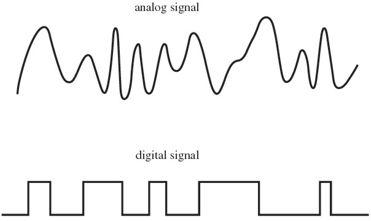

## Technical Basics II
####  Week 1: Introduction
 
 
Lecturer: Qianxun Chen

---

### Programming

<!-- 
Welcome back, catch up, how's summer break
Why?

Last semester we learnt basic programming by learning Python.
What?
Basic ELements/Tools/Schematics -> Breadboard -> Perfboard

Syllabus

Arduino

 -->
---
<!--
 Programming is just a small section of a larger term, computing. As computing not only exists as abstract numbers and concepts, it also changes many other aspects of our life in more physical ways. -->

## Computing
 #### Programming

---

 ### Physical Computing

<!-- Physical computing involves interactive systems that can sense and respond to the world around them. 

sensors that respond to temperature, humidity, distance, touch...
motors, emitting light/beeps into the environment...

-->
 

---

 

---

### Arduino
An **open-source** electronic prototyping platform based on **easy-to-use** hardware and software.

<!-- 

To explore all the possibilities zou can do with physical computing, we are going to learn it with Arduino. Before Arduino, the field of electronics are way harder to enter and one needs to go through a long learning curve to do very simple things.

Arduino as a pjoect makes electronics more accessible to non-professionals and makes it a potential fun/hobby activity one can persuit at home. It's like the Processing project but for hardware. It began in 2005 as a tool for students studying Interaction Design in Italy, and until now it has now a huge community of users and educators, tutorial materials, software and hardware.
-->

---

### Arduino Uno
<!-- There are many development boards you can purchase from Arduino and they are available in different different computational power and sizes.

The most important component on this whole board, is this little black thing in the lower right corner, ATmega 3, 28 p. Everything else on this board is to make it easier to be programmed by your computer, connect to other components without the need of soldering......
-->

- ATmega328p
8-bit AVR microcontroller with 32KB Memory

---

### Microcontroller
- low-cost, single chip, self-contained computer system
- They’re the invisible computers embedded inside drones, 3D printers, toys and wash machines.

---

  
  

---

### Raspberry Pi vs Microcontroller
* Raspberry Pi is closer to a real computer, with more processing power & more memory
  

<!-- But you see the pins? It is also possible to drive some stepper motors, add some sensors or switches to a raspberry pi, if you needs more computation power while at the same time being able to control some simple electronics. -->

---

### Future? 
Uno Q

<!-- But maybe this line between raspberry & Arduino will soon be shaken as Arduino was recently aquaired by Qualcomm, and with this new board Uno Q, a Linux-capable board with a GPU on it that makes it possible to run AI models on it. -->
---

<!-- because it is a platform for both software/hardware, we need more things than the arduino board,the microcontroller itself. -->
#### Components

---
#### Tools & Skills
- Soldering: soldering iron, desoldering gun....
- Multimeter
- Cut/connect/solder/insulate a cable...
- How to read and implement schematics...

---

<!-- Schematics -> Breadboard Prototype 
 -->

---

<!-- -> Perfboard Prototype ( -> PCB Production ) -->
---
### Software
- C++ 
* Code is compiled directly into machine language -> Faster, hardware specific

<!-- Python is an interpreted language. 
It's also possible to control a motor/led using python but remember what we mentioned last semester about the difference between a programming language like python vs sth like C -->

---
### Syllabus

---

### Download
Arduino IDE

<!-- When you open it for first time, it's going to take some time as it needs to download some basic libraries and device drivers from the internet. If it asks you for permission to download/do sth, just click on yes you will need all of them.
 -->
<!-- 
---

### Connecting Arduino to your laptop

* If your system does't allow you to install the newest IDE, you might have the issue of seeing the port greyed out. This might indicate that you need to download the CH340 driver manually. 
 -->

---
### Excercise 1:  Blinking LED
- Check [this video tutorial](https://www.youtube.com/watch?v=fJWR7dBuc18)
- Adjust the blinking speed of your LED to create a binking pattern as you like
- Try reducing the delay value and observe the point at which your eyes can no longer distinguish the blinking—it will appear as if the LED is constantly on.

---
### TODO
- Create a [GitHub Gist](https://gist.github.com/) for your learning log
- Add the link to [here](https://leuphanalg-my.sharepoint.com/:x:/g/personal/qianxun_chen_leuphana_de/Ed36z17VcadDhaB35HPqQr0B8VoFGgQ-eUIUj2ECJxMarA?e=kKn2qg)
