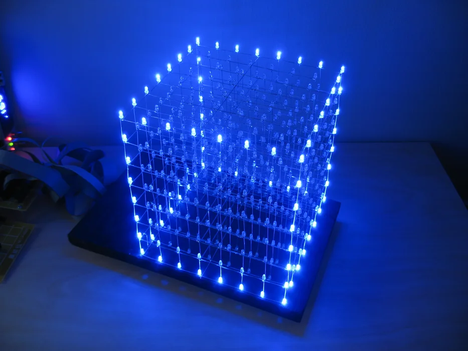
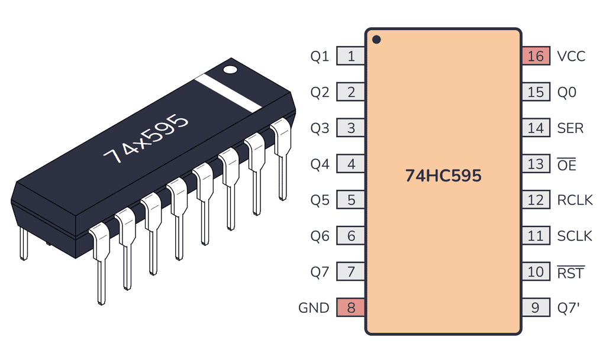
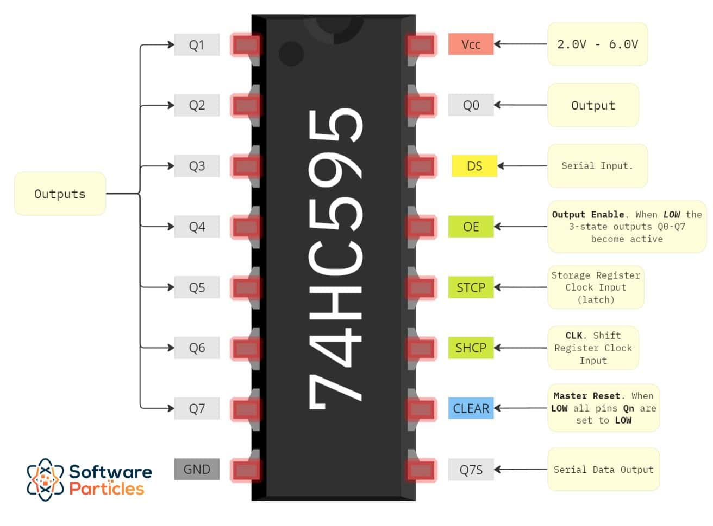
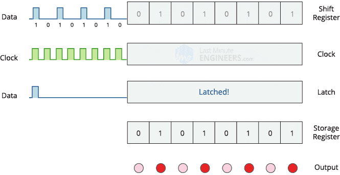
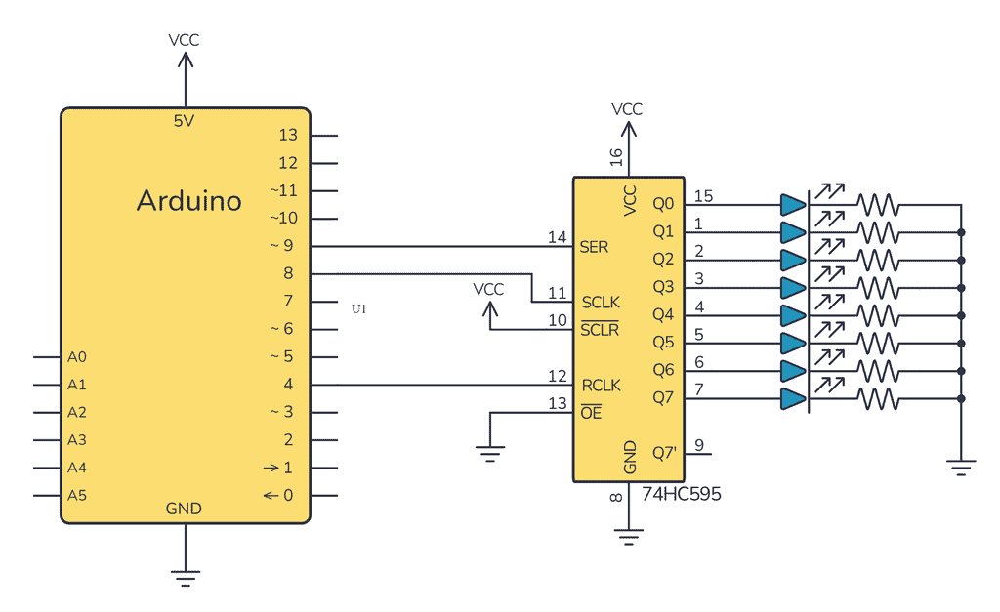
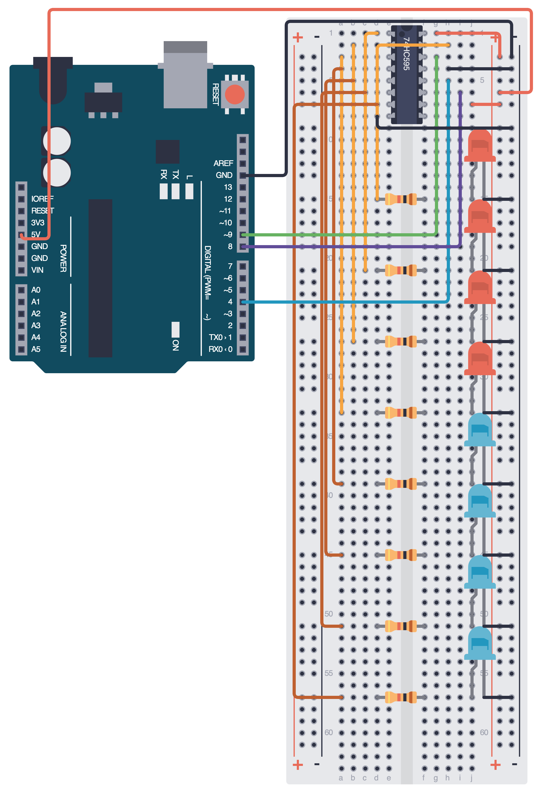
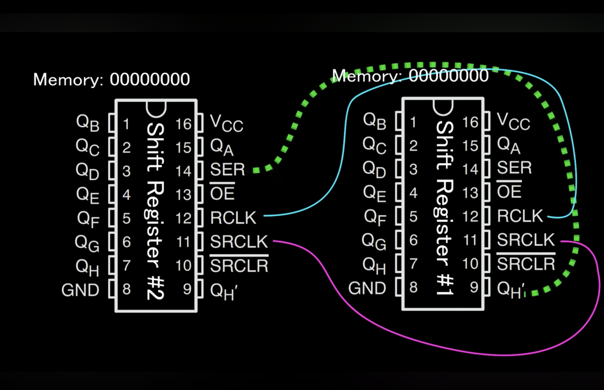

## Technical Basics II
####  Week 11
<br>
<br>
Lecturer: Qianxun Chen

---
#### Multiplexing
A technique used to control or read from multiple inputs/outputs using only a few microcontroller pins 
* individually addressable

 

---
#### 74HC595
- A shift register
- Used to add more output pins to a microcontroller
- Serial-in, parallel-out
- 8 channels
- Max output 70mA for the whole chip

- Parallel-in, serial-out: <b>74HC165</b> (Equivalent of 74HC595 for inputs)

---
#### Pinout


---
#### How does it work



---
#### What do you need
- 74HC595
- 8 LEDs
- 8 220 Ohm resistors
- A lot of wires

---
##### Exercise 1
<br><br><br><br><br><br>



---
#### Connections
- Start with LEDs & resistors
- Then power the IC (VCC & GND)
- Connect the Q0-Q7 with the LEDs
- Connect the control pins of the IC

---

##### Code

```cpp
int latchPin = 4;
int clockPin = 8;
int dataPin = 9;

byte LED = 0b00000010; 

void setup() {
  pinMode(latchPin, OUTPUT);
  pinMode(clockPin, OUTPUT);
  pinMode(dataPin, OUTPUT);
}

void loop() {
  digitalWrite(latchPin,LOW);
  shiftOut(dataPin,clockPin,LSBFIRST,LED);
  digitalWrite(latchPin,HIGH);
  delay(500);
}
```
---
#### Challenge

How to make the LEDs to blink between two patterns?

<!-- Break -->

---
##### shiftOut()

`shiftOut(dataPin, clockPin, bitOrder, value)`
- bitOrder:
    - LSBFIRST: Least Significant Bit First 
    Q0->Q7 1000 0000
    - MSBFIRST: Most Significant Bit First 
    Q7->Q0 0000 0001
- value: the data to shift out

---
#### Exercise 2
Binary Counter with shift register
0 -> 0
1 -> 1
2 -> 10
3 -> 11
4 -> 100
...

---
#### Challenge 2

How to make the LEDs to move in a circular manner? 
00000011
00000110
...
11000000
10000001

(Think about how to move it first towards the left, <br>then towards the right)

---
#### Exercise 3
- Group up with someone <br> to daisy-chain two shift registers
- Both shift registers share the same CLK and latch
- Pin 9(Serial Output) of the first register goes to pin 14(Serial Input) of the second register

- [Code](https://github.com/janisrove/Arduino-74HC595-shift-registers/blob/master/ArduinoLEDsWithShiftRegisters/ArduinoLEDsWithShiftRegisters.ino)

---

##### Notes

- Due to current constraints, it is okay to power multiple shift registers if the LEDs do not all light up simultaneously
- If more lights are needed at one time, it is better to power the shift registers from an external 5V power supply

---
#### Challenge 3

How to flip the bits?
Ex:00001111 -> 11110000

Think about it first with 2 bits
01 -> 10
00 -> 11
11 -> 00

---
### Youtube Video
- [74HC595](https://toptechboy.com/arduino-tutorial-42-understanding-how-to-use-a-serial-to-parallel-shift-register-74hc595/)
- [Binary Counter](https://toptechboy.com/arduino-tutorial-43-binary-counter-with-74hc595-serial-to-parallel-shift-register/)

---

#### Project Q&A
