## Technical Basics II
####  Week 12
<br>
<br>
Lecturer: Qianxun Chen


---
### Display Technology
- Seven Segment Displays
- LCDs (Liquid Crystal Displays)
- OLEDs
- E-ink Displays
- ...
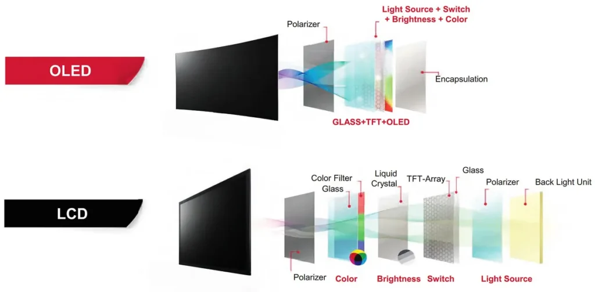


<!-- some even with touch screens... -->

---

### LCD 
(Liquid Crystal Display)
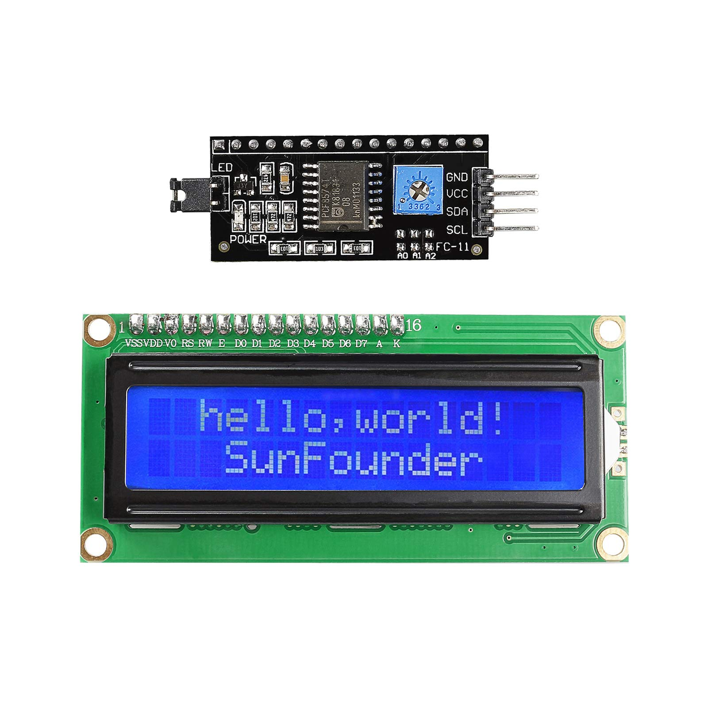

---


<!-- Inside every LCD, there’s a backlight that provides a steady source of light. The special liquid crystals are sandwiched between two layers of polarized glass.

When electricity flows through these liquid crystals, they change their alignment. This alignment affects how light passes through them.
-->
---

A 16×2 character LCD can show 16 characters across each line, with two lines total. Each character is displayed by a grid of 5×8 tiny dots or pixels.

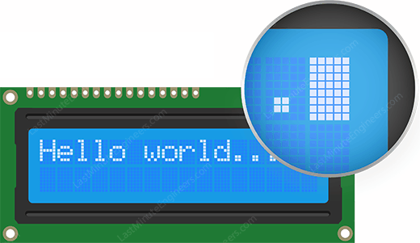

<!-- LCDs come in different sizes and it doesn't matter if they are 16x2 or 20x4, the fundmental principle/how you wire it is more or less the same.-->
---

- `Vo`: controls the contrast of the LCD screen
- `RS` (Register Select): interprete data as commands or characters
- `R/W`: 0 -> sending information to LCD
- `E` (Enable): latch for reading data
- `D0-D7`: 4-bit mode only uses D4-7
- A(Anode) and K(Cathode) to power the backlight
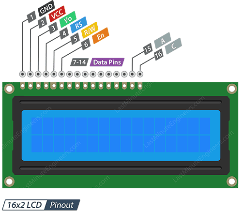

<!-- 
Notice that the vcc/gnd are symmetrical/ protection

4-bit mode is slower but uses less wires, while 8-bit mode is faster it uses even more pins if you connect it directly to arduino -->

---
#### Exercise 1: Simple LCD Screen
- To protect the backlight, we can add a 220 ohm resistor between Anode and 5v
- Library: LiquidCrystal is already pre-installed 
- Potentiometer to adjust screen brightness
- [Code](https://github.com/cqx931/techBasics2/blob/main/Week12/1_basic_lcd/1_basic_lcd.ino)
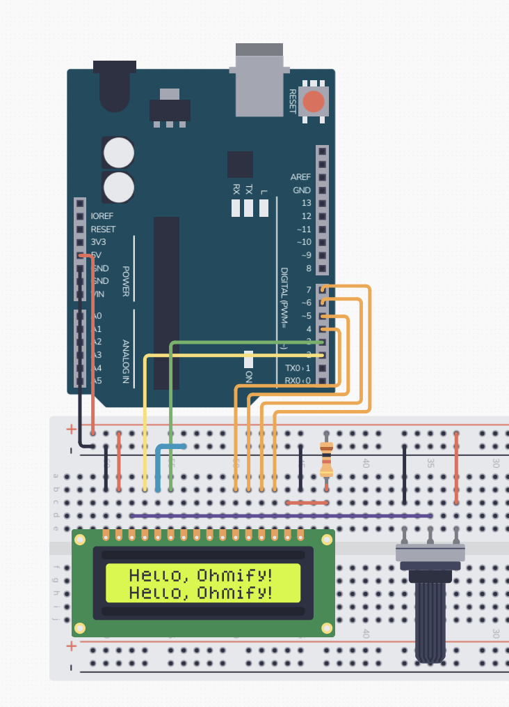

<!-- check 7-segment display module number for elegoo, get one more 74HC595 and one remote from the other kit -->

---
<div class="columns">
<div>
<br>

```cpp
#include <LiquidCrystal.h>

LiquidCrystal lcd(2,3,4,5,6,7);

void setup() {
  lcd.begin(16, 2);
  lcd.clear();
  lcd.print("Hello world!");
  lcd.setCursor(0, 1);
  lcd.print("Tech Basics II");
}

void loop() {}
```

</div>

<div>

##### Useful Functions

```cpp
void loop() {
  lcd.scrollDisplayLeft(); 
  // for visible scrolling speed
  delay(500);
}
```
- `lcd.blink()` and `lcd.noBlink()` turn on or off a blinking block cursor
- `lcd.cursor()`and `lcd.noCursor()`
</div>

</div>

---
#### Fun Challenge: Customize Characters
[LCD Character Creator](https://maxpromer.github.io/LCD-Character-Creator/)

```cpp
byte Heart[8] = {
0b00000,
0b01010,
0b11111,
0b11111,
0b01110,
0b00100,
0b00000,
0b00000
};
lcd.createChar(0, Heart);
lcd.write(byte(0)); //byte(0) is the  Heart character
```

<!-- a grid is 5x8, so we create an array of byte numbers that is represented by binary, each 0/1 represent the state of the pixel. -->
---
#### I2C Adapter for LCD Display
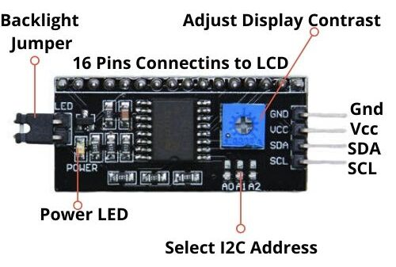

---
<div class="columns">
<div>

#### Exercise 2: LCD + I2C
- Install Libraries: Wire and LiquidCrystal_I2C
- [Code](https://github.com/cqx931/techBasics2/blob/main/Week12/2_I2C_lcd/2_I2C_lcd.ino)
```cpp
#include <Wire.h>
#include <LiquidCrystal_I2C.h>
LiquidCrystal_I2C lcd(0x27, 16, 2);
void setup() {
    lcd.init();
    // Turn on the backlight
    lcd.backlight();
    // The rest works the same
}
```
</div>

<div>
<br><br>

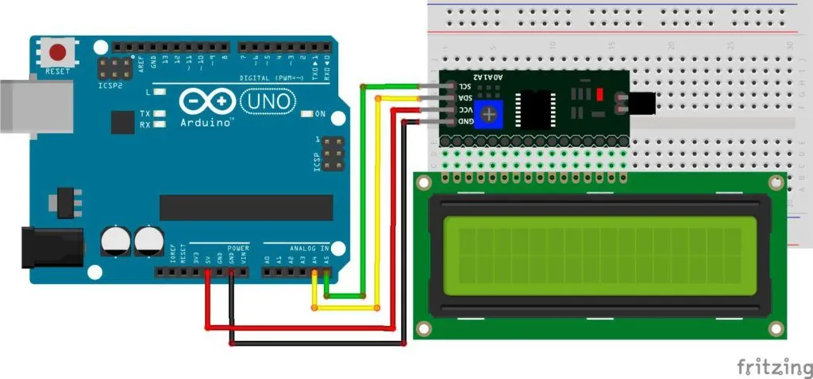

<p class="caption">*If LCD lights up but there's no text, adjust the display contract with a screw driver!</p>

</div>
</div>
<!-- Wire is for I2C
Break
-->

---

#### What if I need multiple LCD Displays?
- adjust the I2C address by soldering the A0-A2 points

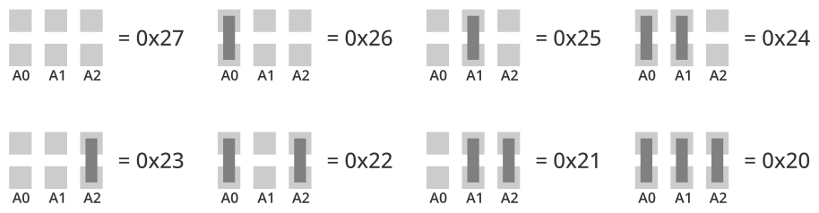

---

#### Arduino Communication Protocols

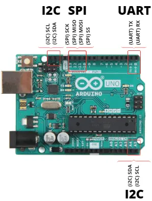

---
##### UART(Universal Asynchronous Receiver-Transmitter)
- The protocol used by Arduino boards to communicate with the computer
- Simple, low-cost, and easy to implement
- 2 PINS: RX(D0) and TX(D1)
- Usages: uploading code or reading data from the board

---
#### I2C (Inter-Integrated Circuit) Protocol
- A multi-master, multi-slave serial communication protocol 
- It allows you to connect multiple devices to the same bus, as each device has a unique address.
- 2 PINS: SDA and SCL (easier to connect than SPI)
- Usages: Display modules,sensors(gyroscopes)...
<!-- slower than spi -->

---
#### SPI (Serial Peripheral Interface)
- A synchronous serial communication protocol used for connecting devices like sensors, SD cards, and other microcontrollers.
- Faster than UART & I2C
- 4 PINS: MOSI, MISO, SCK, and SS
- Usages: Display modules, SD card modules, wireless modules, DAC/ADC chips...

---
#### Keypads


---


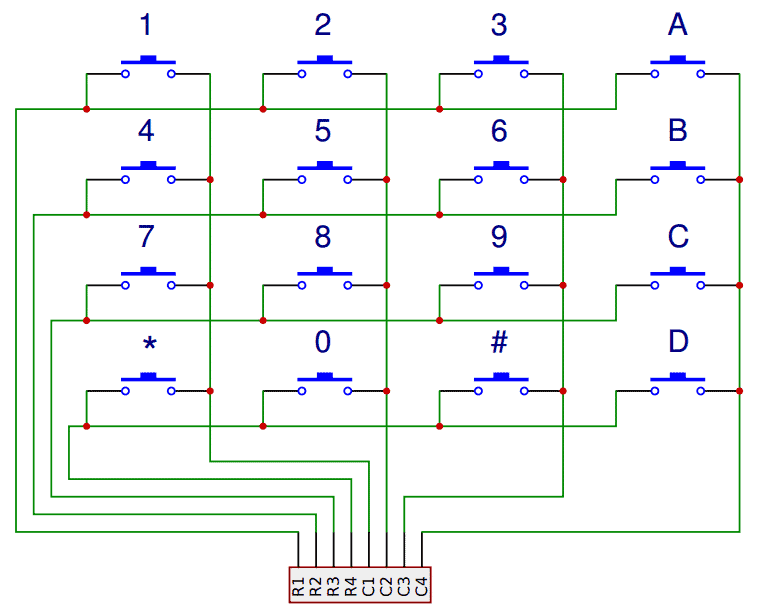

---
<!-- How it works -->
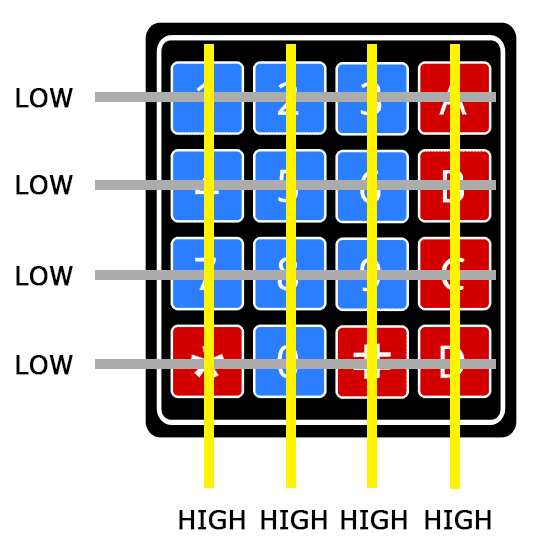
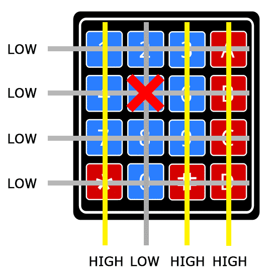
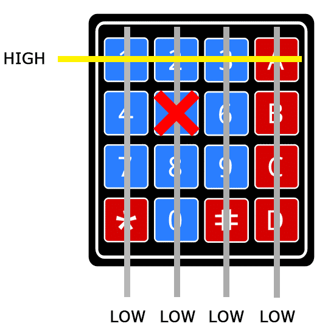


<!-- when nothing is pressed, all the rows are low, cols are high
when a button is pressed: one column will go low -> col
3. Put each row on high, while checking the status of col
4. if at one row, one col is high then we know the row
 -->
---
#### Exercise 3: Keypad Input + LCD(I2C)
- Add keypad on top of the LCD connected with I2C
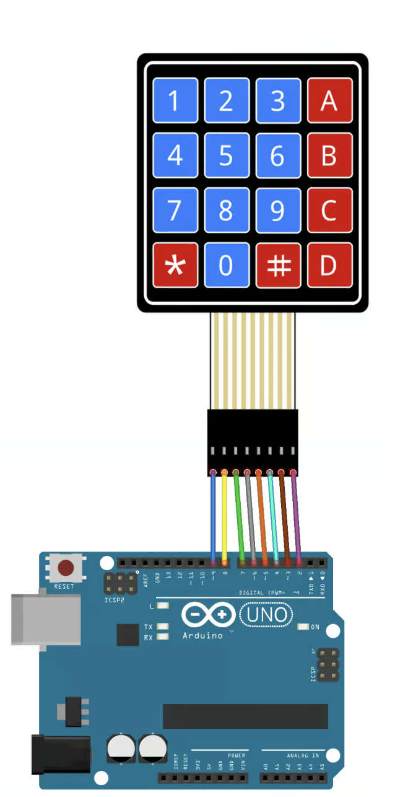
- Install the Keypad library + get the [Code for Keypad](https://github.com/cqx931/techBasics2/blob/main/Week12/3_keypad/3_keypad.ino)
- Now you can change the code to let LCD show the input from the keypad!
---
#### Project Checkups


