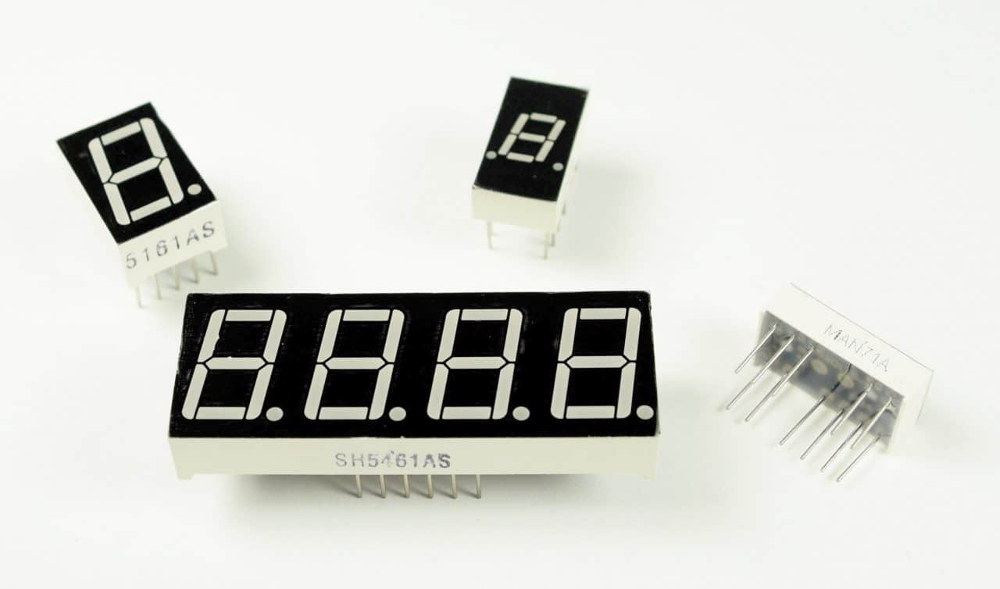
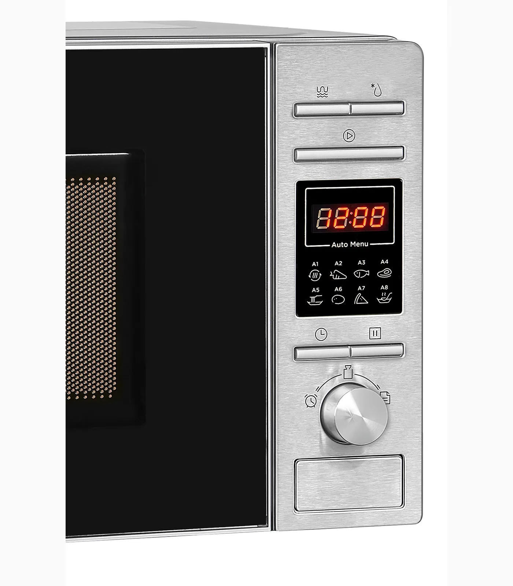
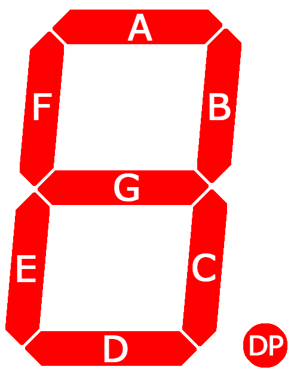
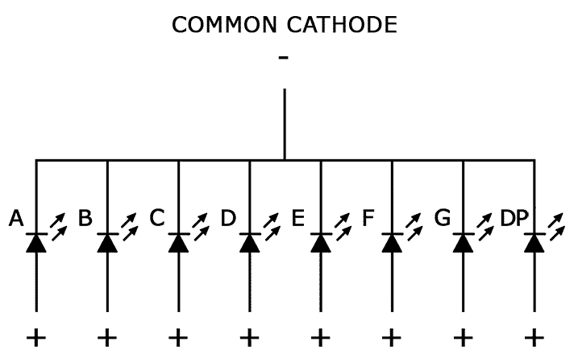
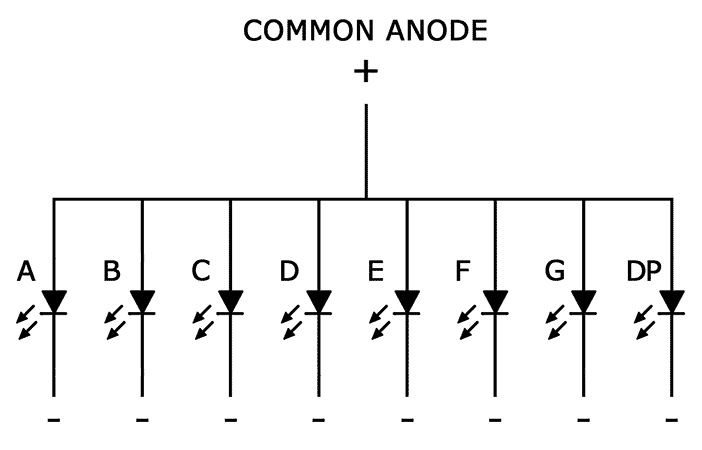
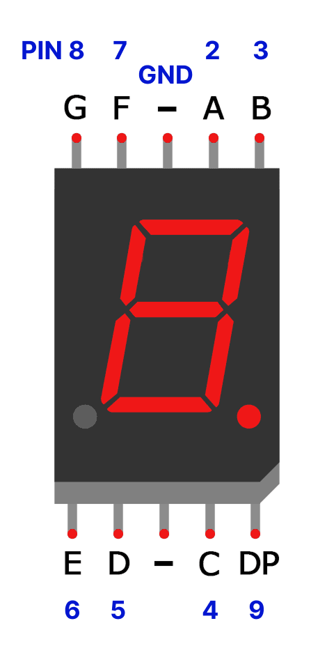
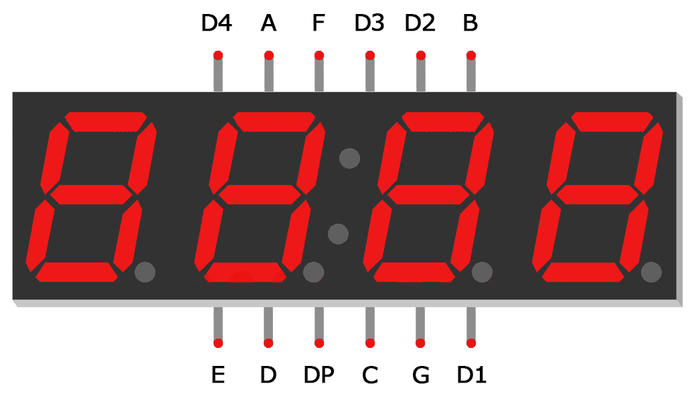

## Technical Basics II
####  Week 13
 
 
Lecturer: Qianxun Chen

---
#### Seven Segment Displays
       

---
#### How it works

- Seven segment displays consist of 7 LEDs(A-G), called segments, arranged in the shape of an “8”
- \+ 8th segment: DP for the decimal point
- Each segment on the display can be controlled individually, just like a regular LED.
---
#### Two Types
         

<!-- similar as RGB LED, the 7-segment displays also have two types 
Cathod - A
Anode - B
-->

---
#### Exercise 1: 1-digit 
- 5161AS(Common Cathode)
- Library: [SevSeg](https://docs.arduino.cc/libraries/sevseg/)
- [Code]()

---
<!-- need to edit the image, the order of d1-d4 is reversed -->

- 4-digit 7-segent display
- 3461BS (Common Annode)

---

#### Exercise 2: 4-digit

---

<!-- Break -->

---

#### Exercise 3:  7-segent display with 74HC595
- Add 74HC595
- Add a sensor
- Display sensor reading on the display

<!-- 
#### Reference
https://www.circuitbasics.com/arduino-7-segment-display-tutorial/ -->
---
#### Project Checkups