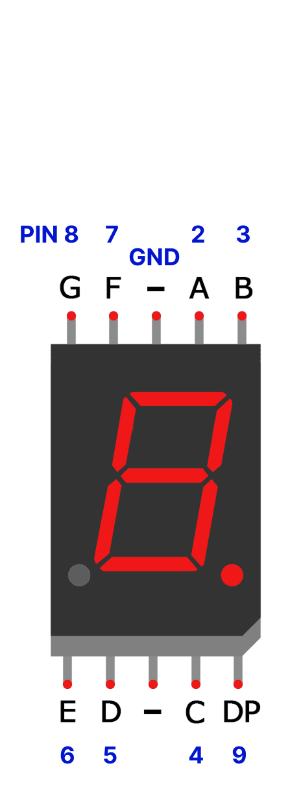
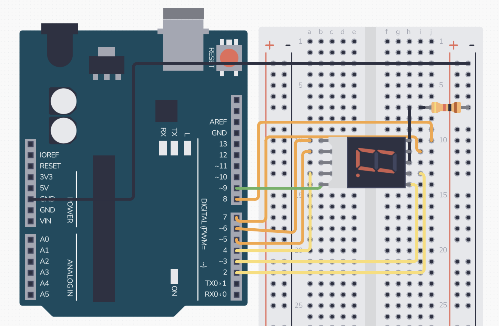
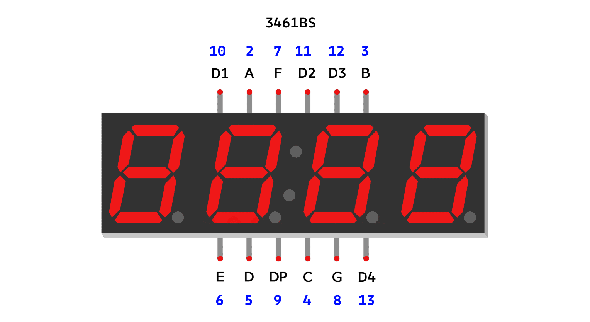
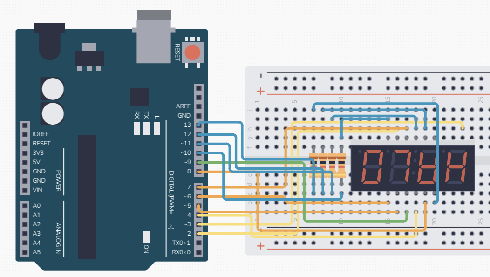
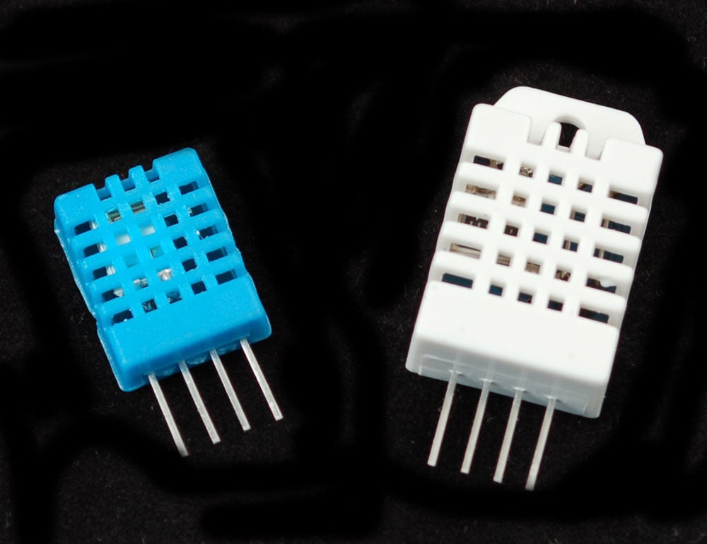

## Technical Basics II
####  Week 13
 
 
Lecturer: Qianxun Chen

---
#### Seven Segment Displays
       

---
#### How it works

- Seven segment displays consist of 7 LEDs(A-G), called segments, arranged in the shape of an “8”
- \+ 8th segment: DP for the decimal point
- Each segment on the display can be controlled individually, just like a regular LED.
---
#### Two Types
         

<!-- similar as RGB LED, the 7-segment displays also have two types 
Cathod - A
Anode - B
-->

---
#### Exercise 1: One-digit Seven-segment Display
- 5161AS(Common Cathode)
- Library: [SevSeg](https://docs.arduino.cc/libraries/sevseg/)
- [Code](https://github.com/cqx931/techBasics2/blob/main/Week13/1_SevSeg_one_digit/1_SevSeg_one_digit.ino)

        

---

#### Four-digit seven-segment display
- Miuzei: 3461BS (Common Annode)
- Elegoo: 5641AS (Common Cathode)
- [Code](https://github.com/cqx931/techBasics2/blob/main/Week13/2_SevSeg_four_digit/2_SevSeg_four_digit.ino)

---

#### Exercise 2: 3461BS 
The order of D1-D4 is reversed on 5641AS 

        

<!-- Break -->
---

#### Exercise 3: 7-segent display with 74HC595
- Add 74HC595 
- A-G, DP to Q0-Q7
- Arduino: DS to pin8, STCP to pin7, SHCP to pin6
- OE to GND, CLEAR to 5V
- Library: [SevSegShift](https://github.com/bridystone/SevSegShift)
- [Code](https://github.com/cqx931/techBasics2/blob/main/Week13/3_SevSeg_shift_register/3_SevSeg_shift_register.ino)

---

#### DHT Sensors
- DHT: Digital Humidity and Temperature (DHT11)
- Library:[DHTstable](https://github.com/RobTillaart/DHTstable/tree/master)
- Other models: DHT22, AM2302...

- Data pin to pin 5 [one can also use pin 14(A0) or other analog pins]
- [Code](https://github.com/cqx931/techBasics2/blob/main/Week13/4_DHT/4_DHT.ino)
---

#### Exercise 3: Challenge
Display sensor reading on the display

<!-- 
#### Reference
https://www.circuitbasics.com/arduino-7-segment-display-tutorial/ -->
---
#### Project Documentation and Evaluation
<!-- 3d printer is there, when to install? (next wednesday?) -->