## Technical Basics II
####  Week 2
<br>
<br>
Lecturer: Qianxun Chen

---

#### Reminder: Registration for Exam
Deadline: 27 October 2025 (23:59)

---

### Catch up from last week
<!-- let's write the code together from scratch -->

---
### LED
* Light Emitting Diode
* long leg is +
 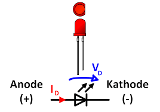

<!-- smd led on your arduino -->
---

#### High-power LED
- Super bright, but consumes a lot of energy

 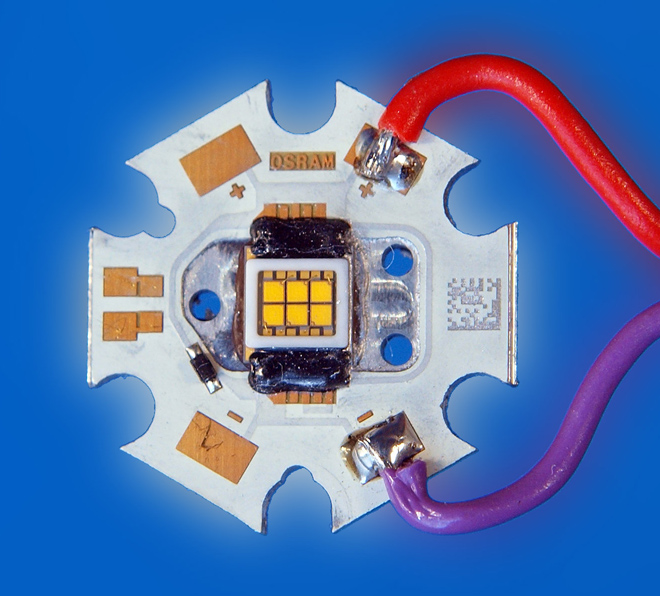
 
---
### Exercise 1
- Conect a LED to pin 13 of Arduino
- What is happening?

 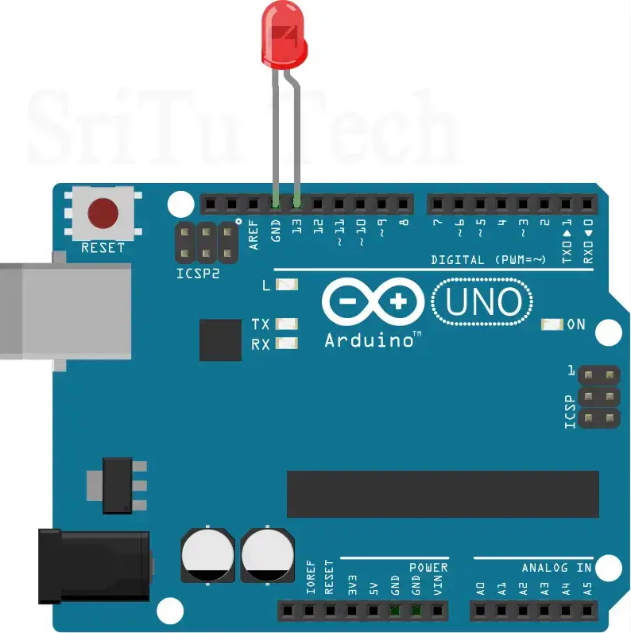

<!-- it's blinking but it's not the best way to connect a led -->

---

<div class="columns">
<div>
<br>

### Resistors


 

 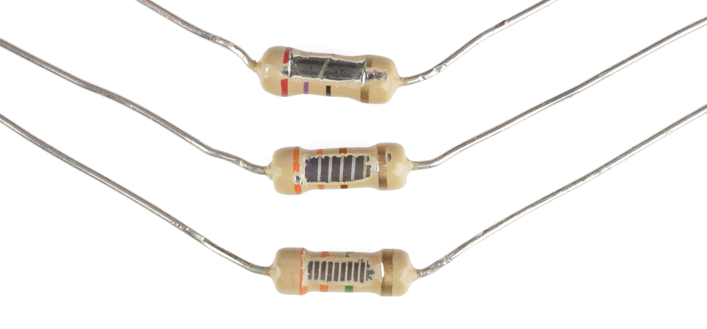
</div>

<div>

  

 <div class="caption"> THT <br>
Through Hole Technology
</div>

 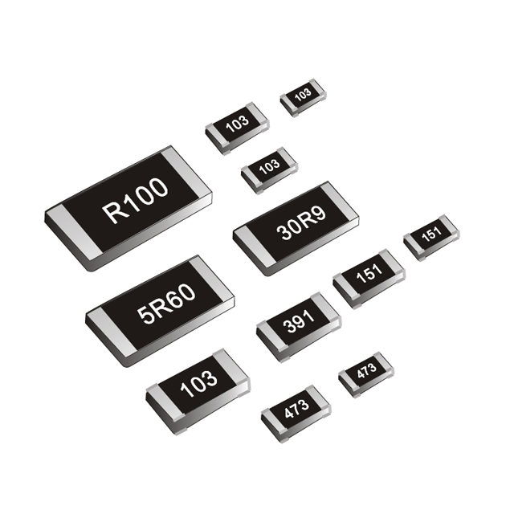


<div class="caption"> SMD <br>
Surface Mount Devices
</div>
</div>
<!--  -->

---
### Resistor Color Code


<!-- 
The colours on a resistor follow a particular set of rules. There can be 4-band/5-band resisotrs. But they all have multiplier & thetolerance.If you takea look at your resistor bag, you will find they are 5-band resistors and they all have colour brown on one side and that's the tolerance.

you also have this on this paper in your starter kit. take a 1k resistor.

according to this color code how should a 1k 5-band resisotr look like? (brown, black, black, brown + tolerance)
-->
---

### Breadboard


<!-- power rails, in the middle is the component area -->

---
#### How to place a component on a breadboard

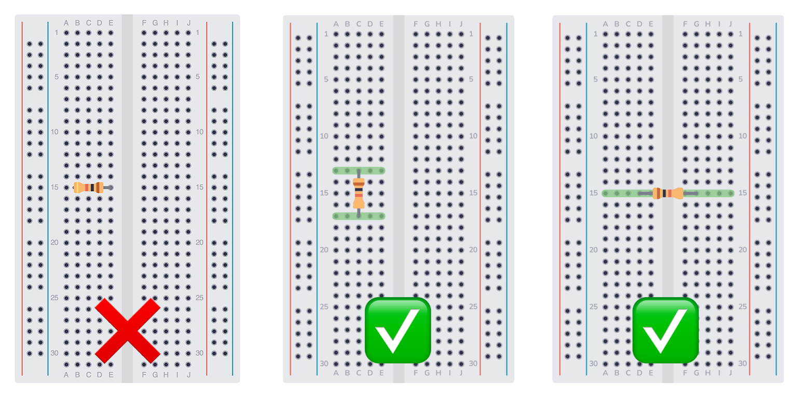

<!-- you shouldn't put different legs of one component along the connected holes, the green area are places where you can put other components that shall be connected to this leg -->

---
### Wires
- Jumper Wires
- Types: M/M, M/F, F/F
- Good habits: red wire for +, black wire for -

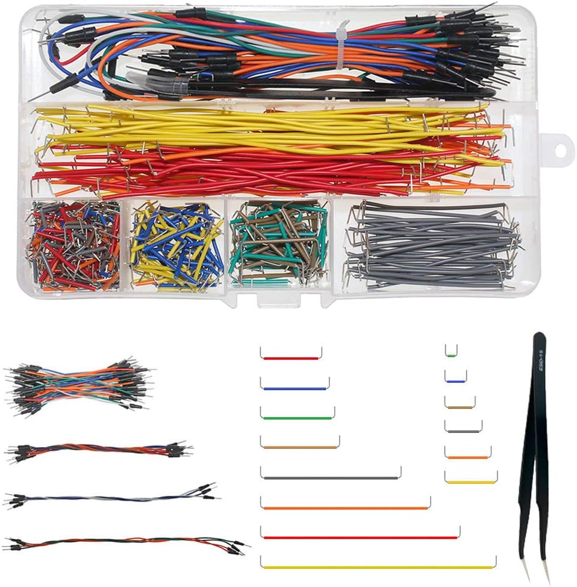

<!-- easier to debug! -->
---
#### What you should NEVER do
- Directly connecting the + and - 
-> short circuit (potentially break baords/components)

---
#### Exercise 2: 
220Ω Resistor
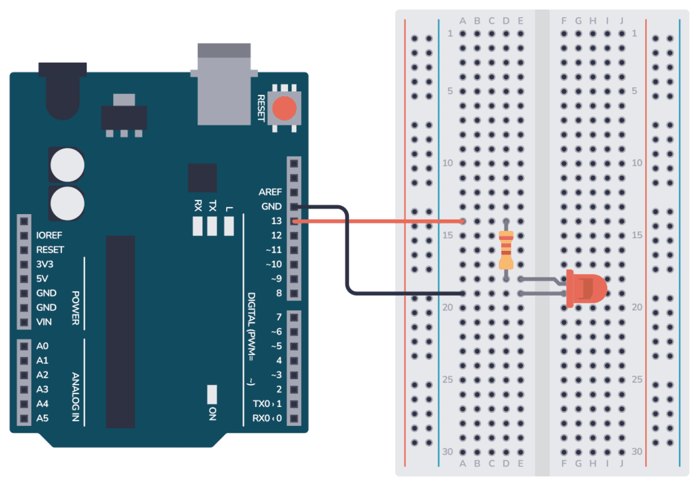

<!-- if we connect the orange line to 5v from arduino, led is always on -->

---

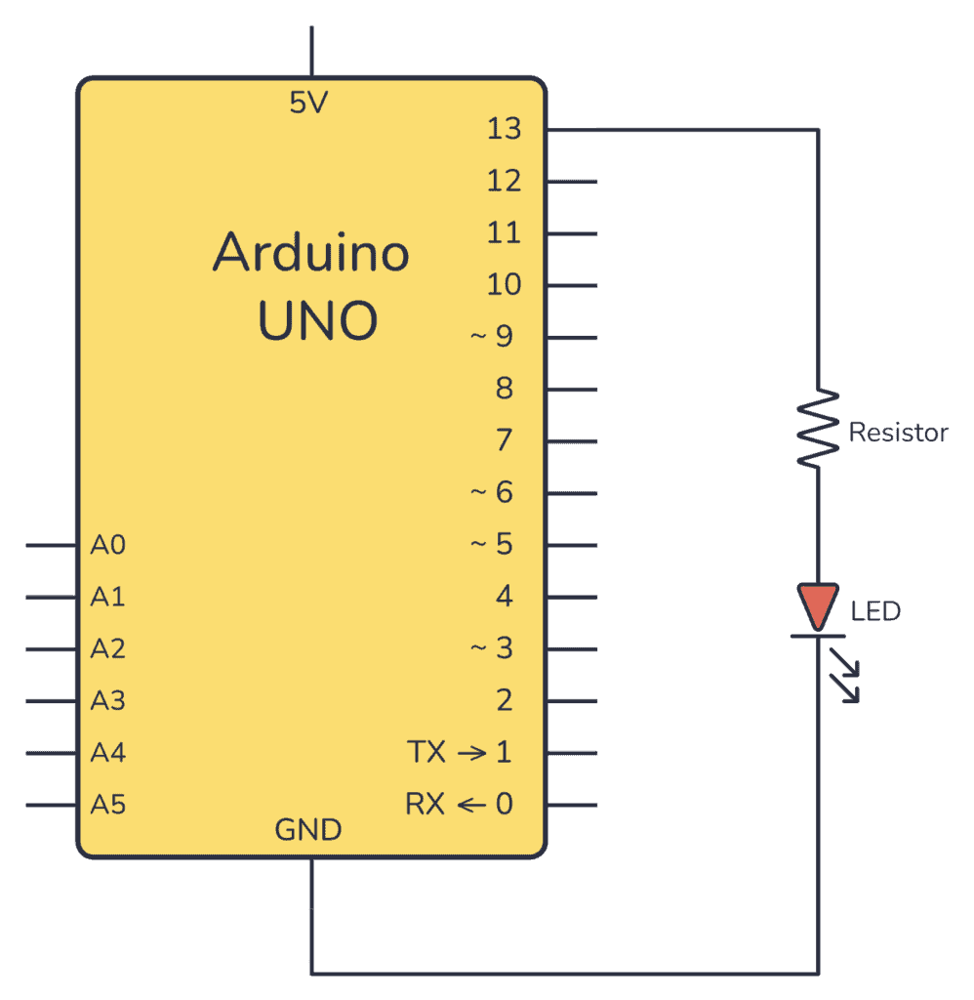

---

### GND
- The circuit's common ground, acting as a zero-volt reference and a return path for current.
- In a direct current (DC) circuit, the negative (-) terminal is often designated as the "ground"

---

### How to power your breadboard
- Arduino
- Power supply module
- Battery / power source

---

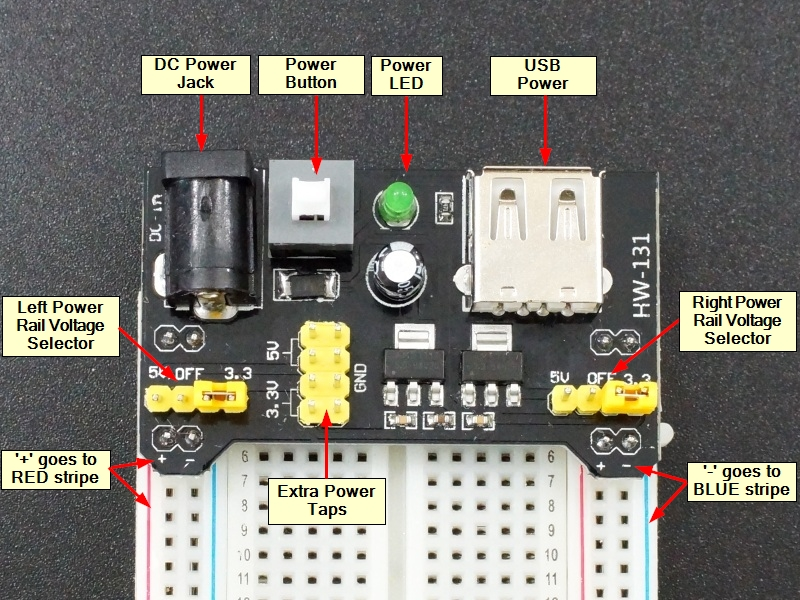

<!-- 
Break, later Theory -->

---

|  | Symbol | Unit | 
| ------ | ------ | ------ |
| Voltage |    V | Volt, V |
| Current  |  I | Amp, A |
| Resistance  |  R | Ohm, Ω |

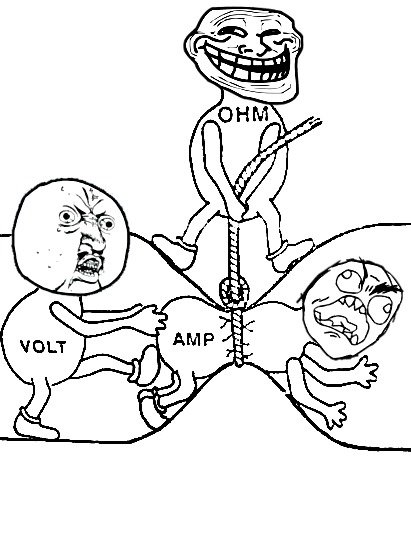

<!-- If we take water as an metaphor for electricity, Voltage is like water preasure, resistance related to the size of the tube, while current is the amount of water that actually flows in the tube.-->

---
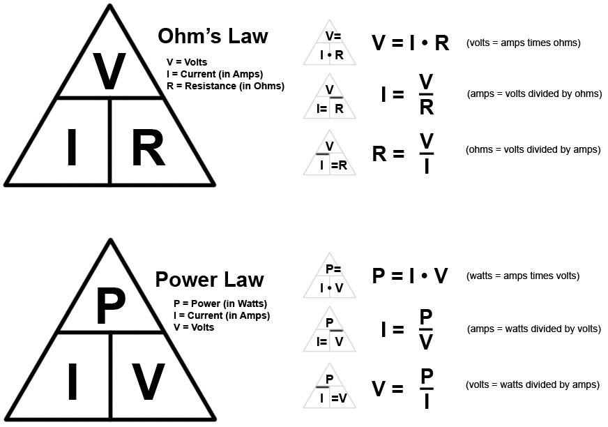

<!-- power is useful if you need to use a battery and wants to decide the battery you needs to use  -->
---
Why do we use a 220 Ohm resistor earlier?
* For current limiting
* 5 = I * 220
* 0.02A(20mA) is a safe current for common LEDs
<!-- feel free to change it to 330, the light will become dimmer,200-500 range is good -->
---
### Direct Current vs Alternating Current

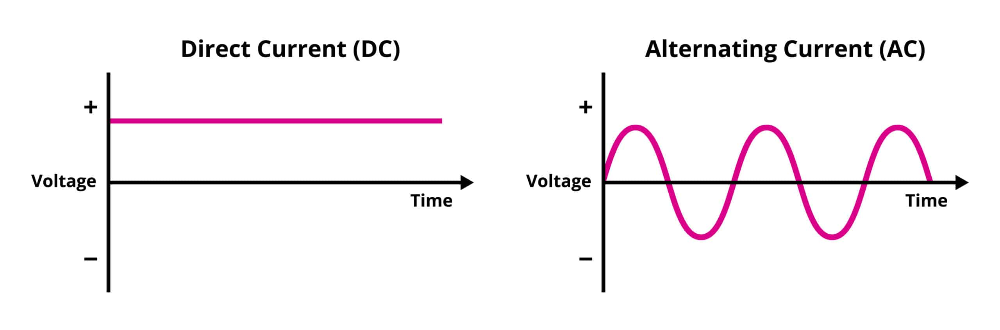

<!--
DC: Smaller devices, stable, simple to design circuits
AC: More practical in long distance power transmission, easier to change voltage -->

---
### Common Voltages for DC
- For Microcontrollers: 5v, 3.3v
- 9v 
- 12v

<!--  
In arduino we are dealing mostly with 5v, older technologies, more robust but more power consumption
3.3V for modern microcontrollers, lower power consumption 

If sth is supposed to work with 12v, a lower voltage of 9v might be able to still make it work, but the other way around will be dangerous
-->
---


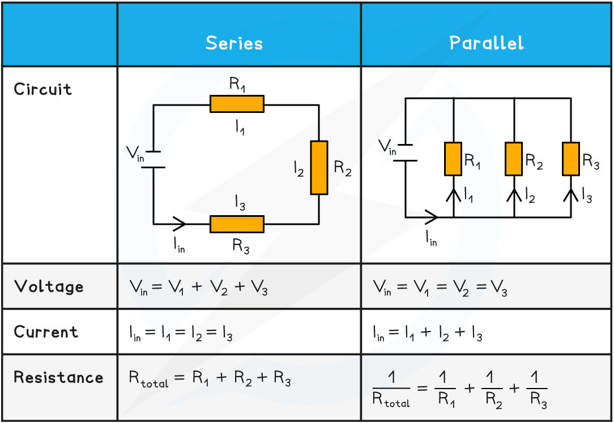
<!-- series: shared current, devided voltage
parallel: shared voltage: devided current -->
---
<!-- 
No arduino,
vcc stands for voltage common collector
It is the positive supply voltage for an electronic circuit

-->
#### Exercise 3
- Power your breadboard with the power supply module
- Set it on 5v
- Practice parralel/series circuit with two LEDs on breadboard


---

#### Exercise 4
- Connect one red, one yellow, and one green LED to pin 2,3,4 on your Arduino
- Coding: Write a program to make the LEDs shine simultaneously and then in sequence.


<!-- Break -->

---
### RGB LED
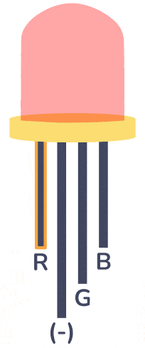

---
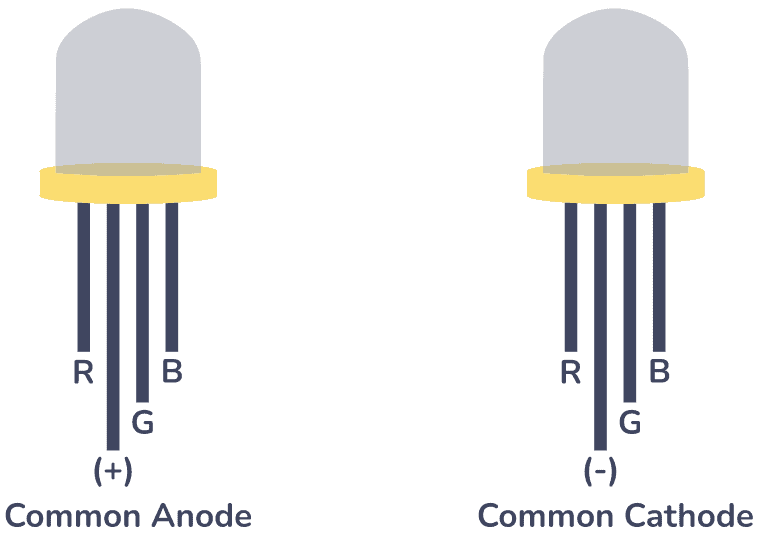

---
### In our case: Common Cathode
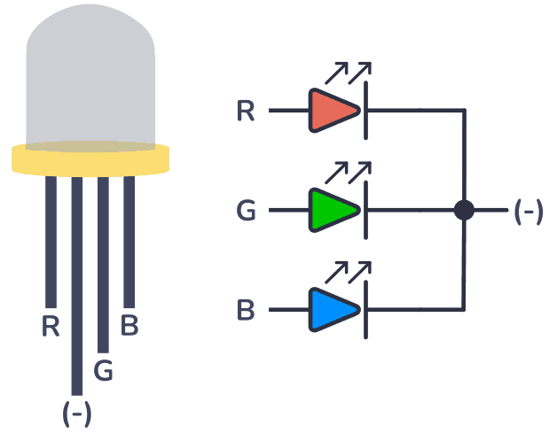

---
#### Exercise 5
- How will you connect this RGB LED to arduino?
- How many resistors do you need?
- First use the same code as Exercise 4
---
<!-- we can't share one led among them. because led in different colors requires different amount of voltage -->
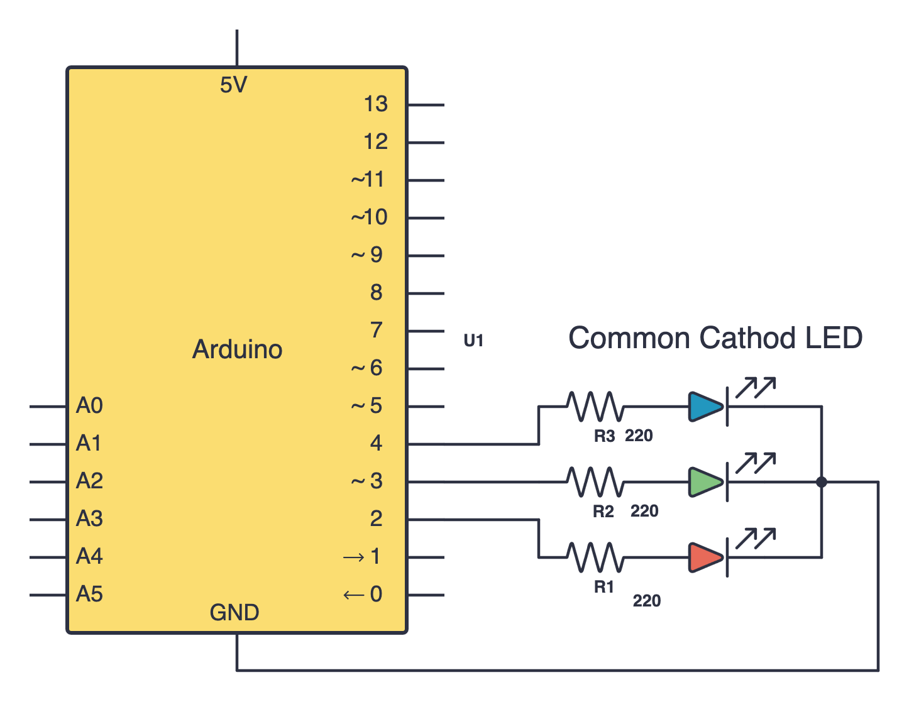

---

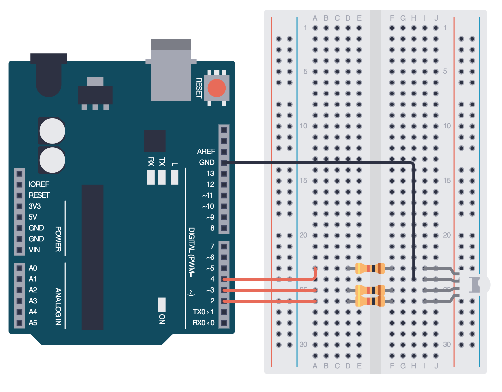

---
#### Challenge 
- Write a  `setRGB()` function that accepts RGB values to change color freely
- Use it to modify the RGB LED to different colors

```cpp
void setRGB(int redValue, int greenValue, int blueValue) {

}
```
