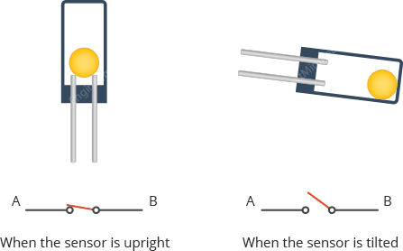
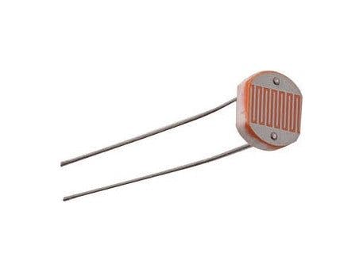

## Technical Basics II
####  Week 3
<br>
<br>
Lecturer: Qianxun Chen

---
#### digitalWrite() / digitalRead()

HIGH - 5V
Low - 0V

-> Both Digital and Analog Pins
<!-- LED, and same with digital read-->

---


<!--

TX(transmit), RX(Receive) reserved for serial communicaation, usually we don't use these two pins, you can use these two pins as normal digital pins if no serial communication is needed
2-13 digital pins + PWM
Analog Pins
Vin: Power Arduino nano,7-12 v
Go through step down regulator to provide 5v/3.3v on board
I/O ref
 -->
---

- TX(transmit), RX(Receive) are reserved for serial communicaation, usually we don't use these two pins, you can use these two pins as normal digital pins if no serial communication is needed
- 2-13: Digital I/O pins, ~ for PWM
- A0-5: Analog Input Pins
- Vin: to power the Arduino Uno (7-12V)
- Reset: does the same job as the reset button
- IOREF: Reference Voltage for all I/O pins, connected to 5v on Arduino Uno

---
### analogWrite() - PWM
- Pulse-Width Modulation, is a digital method of controlling analog power by rapidly switching a signal on and off.
- 0 - 255 : 0v - 5v (8 bits)
- It is a widely used technique in dimming LEDs, controlling motor speed, etc.

<!-- 125 ~ 2.5v,but what is actually happening is not that you have real 2.5v, but a simulation -->
---


Duty cycle: the proportion of "on-time" in each cycle

<!-- Show it with an oscilloscope? -->
---
#### Exercise 1 Fade in/out a LED
- Connect one LED to a PWM pin (with a 220 resistor)
- Use analogWrite() to control its brightness

<br>

- Coding Challenge
  - Instead of on/off, use for loop to fading effect
  - Tip: use delay() and the length of delay will influence the speed of fading

```cpp
for (int i=0; i <= 255; i += 5) {
}
```
<!--
python for i in range(0, 255)

Stream A: Spend some time with RGB LED function

Break -->

---

- Analog signals are <b>continuous</b> and vary <b>smoothly</b> over time
- Digital signals are <b>discrete</b> and usually represented by binary states (01)


<!-- analog signals: more resolution, slower to process, more sensitive noises
 digital signals, faster and reliable, less sensitive to noises

 So now we want to read some signals with arduino, but in order to know what is happening in this process, we want
 -->
---
### Serial.print()

```cpp
void setup() {

  Serial.begin(9600); // open the serial port at 9600 bps:

}


void loop() {
  Serial.println("Hello"); // print with new line
  //Serial.print("Hello"); // print in the same line
}

```

---

### Serial Baud Rates
- Serial baud rates are the number of signal changes per second in a serial communication channel
- The specific rate must be <b>matched</b> between the transmitting and receiving devices for successful communication.
- Most commonly used value for Arduino: 9600 bps

---
### Tilt Switch
- A component that can detect the tilting of an object



<!-- - It contains a metallic ball inside that will commute the two pins of the device from on to off and vice-versa if the sensor reaches a certain angle.If you tilt it you can hear the metal ball
 -->
---

#### Exercise 2 DigitalRead()
- Try out DigitalRead() with Tilt switch
- Print the result in your serial Monitor


---
### AnalogRead()
- An analog pin will give you a value between 0 and 1023, where 0 means 0V and 1023 means the maximum voltage possible (5V by default).
- You can only use analogRead() on Analog pins
<!-- why? becuase these pins are connected to ADC -->

---
### ADC
- An Arduino Uno contains a 10-bit, 6-channel analog to digital converter (ADC)
- A device that converts an analog signal (voltage) into a digital value
* You can set the AREF(Analog Reference) pin to sth lower than 5v for higher resolution for low voltage component

<!--
10 bit means 0-1023
If you want a true analog signal from Arduino, you better use a DAC-->
---
### Potentiometer
- A potentiometer is an adjustable resistor


---


---

#### Exercise 3 AnalogRead()
- Try analogRead() with a potentiometer on A0
- Print the reading and check it in Serial Plotter
* Challenge: Dimm a LED with with a pot
  - map()


<!--
Try to switch 5v/ground, what does it change?
 -->

---

##### Voltage Divider


<!-- Break -->

---
#### Serial Read

```cpp
void loop() {
  if (Serial.available()) {     // wait for data available
    // for strings
    String str = Serial.readString();  
    str.trim();  //  remove any \r \n whitespace at the end of the String

    //for int
    int integer = Serial.parseInt();
  }
}     
```
---
#### Exercise 4: Read input from Serial
- Read Input from serial and use it to turn on/off the on-board led
- Level Up: Parse an integer to control the brightness level of an LED on PWM pin
<!-- use serial to control the led -->

---
#### Debugging Tool: Multimeter
- Check connections
- Measure the voltage between two points
- Measure resistance


<!-- com to black cable, mavohm to red cable
demonstrate connection mode and voltage mode for battery
-->
---
### Photoresistor
- also called a light-dependent resistor (LDR), is a light-sensitive variable resistor whose resistance decreases as the intensity of light hitting its surface increases.



<!-- Try to measure the resistance of photoresistor using a multimeter?

more light, less resistance -->


---
#### Exercise 5 analogRead() with Photoresistor
- Next Step: If light is low, turn on an LED, otherwise turn it off
<br>
<br>
<br>
<br>
<br>
<br>
<br>
<br>


<!-- we are measuring the voltage r1 got
resistance 0 -> r1 got 5v
resistance up -> r1 got less
 -->


---

How to calculate the actual resistance
of LDR using ohm's law?


<!-- explain the logic here -->

---
### Wrap Up
- analogWrite() & PWM
- Serial monitor
- Components: tilt switch, potentiometer, photoresistor
- Multimeter
<!--
Reference:
https://www.build-electronic-circuits.com/arduino-light-sensor/

https://www.instructables.com/How-to-Use-a-Light-Dependent-Resistor-LDR/

 -->
<!-- ---

 ### Potential Assignment
 - Thermistor works in similar way as Photoresistor, research about it and try to get some readings from it -->
