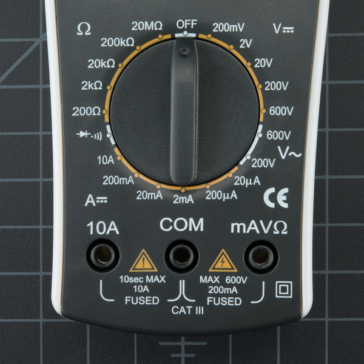

## Technical Basics II
####  Week 4
<br>
<br>
Lecturer: Qianxun Chen

<!-- sound, make some noise -->
---
### Catch Up
<!-- 
remind about gist, i do check :)))

stream A is photoresistor, calculate the resistance of photoresistor?
stream B is serial read, just combine it with active buzzer-->

---

### Buzzers
- Active Buzzer: it can produce sound directly when connected to power (built in oscillator)
- Passive Buzzer: it requires an AC signal in order to make sound
<!-- a simulation of AC, high low -->


<!-- Active buzzers are called ‘active’ because they can produce sound directly when connected to a battery. If we connect the positive and negative terminals properly to the battery, It can generate sound by itself because it has a build-in oscillator. 

 -->
---

<!-- 
speakers, coil, membrane
electricity directly connected to a piezo material, ceramic disk

passive buzzer has this green black, while active is black
active buzzer have longer/shorter leggs, passive save length 
active buzzer is a bit taller -->


----
##### Exercise 1 Passive Buzzer
<!-- play some notes -->
- Connect a passive buzzer to your Arduino 
- Play different frequencies with
```cpp
tone(pin, frequency, duration)
```
- It generates a square wave of the specified frequency (non-blocking function)


<!-- 
check doc for tone 
- none blocking
- frequency range
- noTone()
- can't use tone while pwm on pins 3 and 11

https://docs.arduino.cc/language-reference/en/functions/advanced-io/tone/
 -->
---
#### Exercise 2 Play Melody
- Code: File/Examples/02.Digital/ToneMelody
- Popular songs: https://projecthub.arduino.cc/tmekinyan/playing-popular-songs-with-arduino-and-a-buzzer-546f4a
```cpp
#include "pitches.h" // library
```

<!-- if there is time, show that a mini speaker can be connected in similar way

15min break -->

---
#### Ultrasonic Distance Sensor


---


<!-- The sensor has a transmitter and a receiver. When you trigger a pulse (using the Trig pin), the transmitter sends a short burst of ultrasonic sound waves.

the sound wave travels through the air until it hits an object and gets reflected back towards the sensor.

The receiver part of the sensor (connected to the Echo pin) waits for the reflected sound waves to return. One can calculate the distance using the time delay between the emission and the reflection of the signal

-->

---
#### Exercise 3 Ultrasonic Distance Sensor
- Read from an ultrasonic distance sensor
- What's the distance range it can detect?
- Next: Add a positive buzzer and make it beep if distance is too close


<!--
2cm - 400cm
It's possible to change the pitch of active buzzer a little bit
https://www.youtube.com/watch?v=W5AApP9P-b0
(manually changing duty cycle)
-->
---
### Application
- Object Avoidance
- Distance or Height Calculations 
  (Level of water...)


---

### Similar Sensors

Infrared Sensor


---
### Push Buttoms


---
### Pull-up & Pull-down Resistors


---
#### Debugging Tool: Multimeter
- Check connections
- Measure the voltage between two points
- Measure resistance


<!-- com to black cable, mavohm to red cable 
demonstrate connection mode and voltage mode for battery 

sometimes the buttons don't have a good connection with the breadboard
-->
---
#### Exercise 4  Button (Pull-down)
- Connect a push button to your Arduino with a 10k pull-down resistor
- The signal should be 0 if the button is not pushed, and 1 if it is pushed (verify with serial print)

- Challenge: Try pull-up resistor by yourself

---
#### Exercise 5 Buttons + Buzzer
- Make an instrument with a passive buzzer and multiple buttons (You can decide if you want to use pull-up resistors, pull-down resistors or internal pull-ups)
- Define the note each button can play

---
#### Extra Material
- [How to change the pitch of active buzzer](https://www.youtube.com/watch?v=W5AApP9P-b0&list=PLGs0VKk2DiYw-L-RibttcvK-WBZm8WLEP&index=23)

---
#### Wrap Up
- Active/Passive Buzzers
- Ultrasonic Sensors
- Buttons and pull-up/pull-down resistors
- Multimeter
<!-- McWhorther Tutorials 22-24 buzzers, 27-28 push buttons-->


<!-- take more buttons from library, mini speakers 
take home, dc motor related material
-->