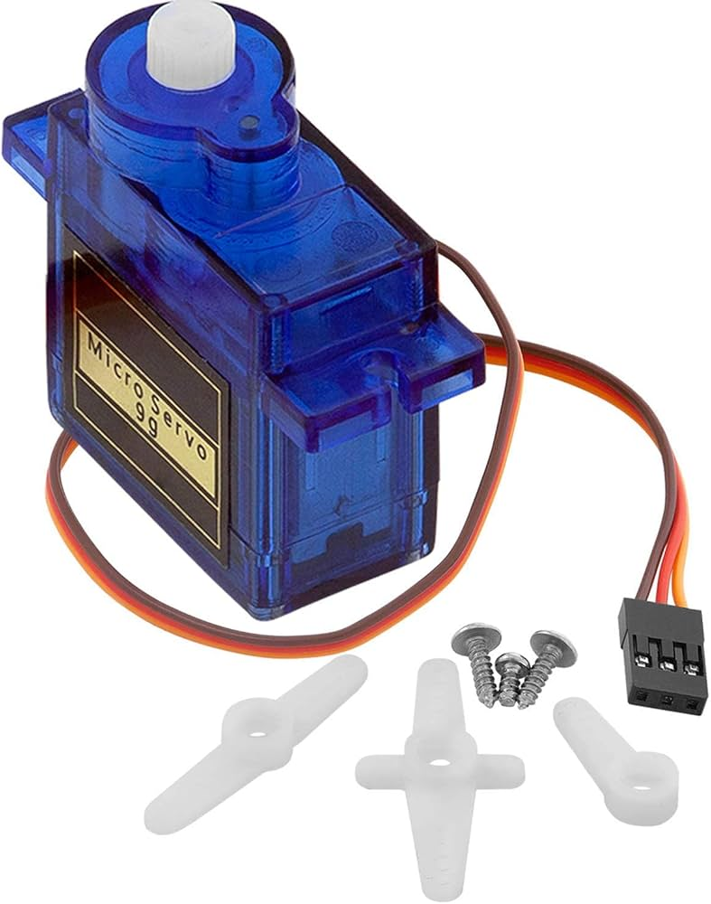
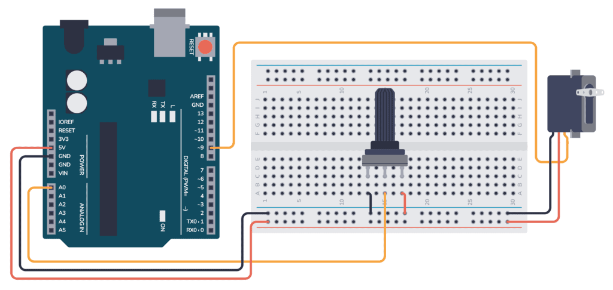
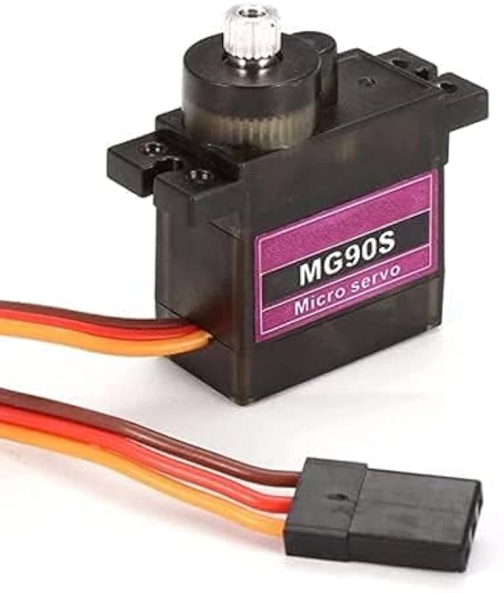
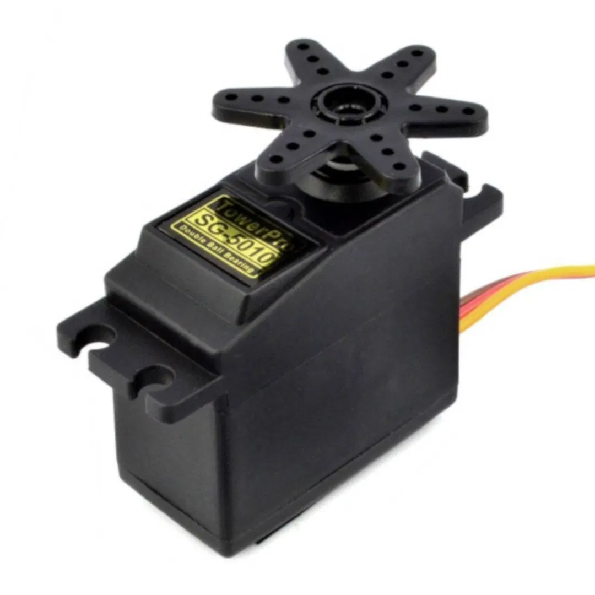
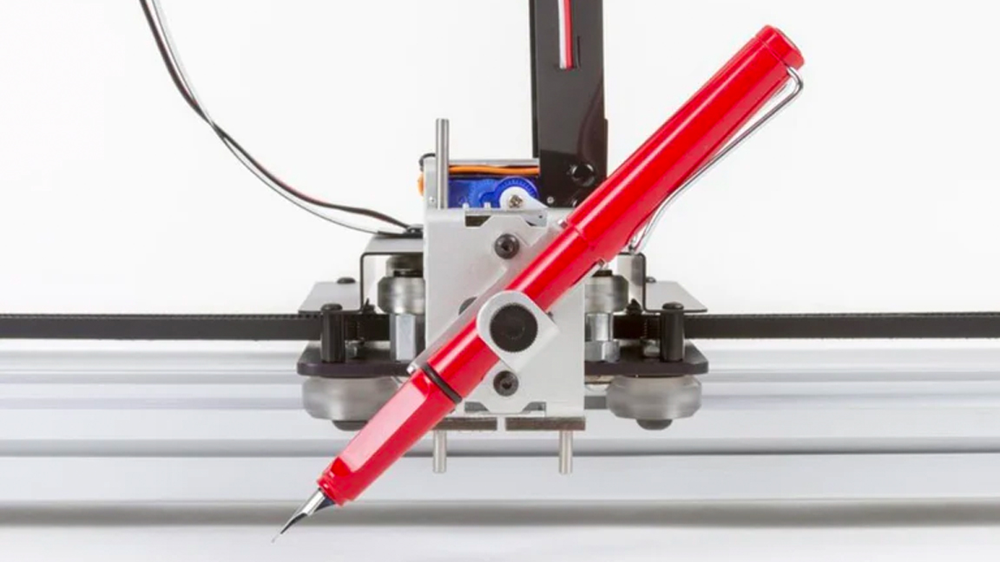
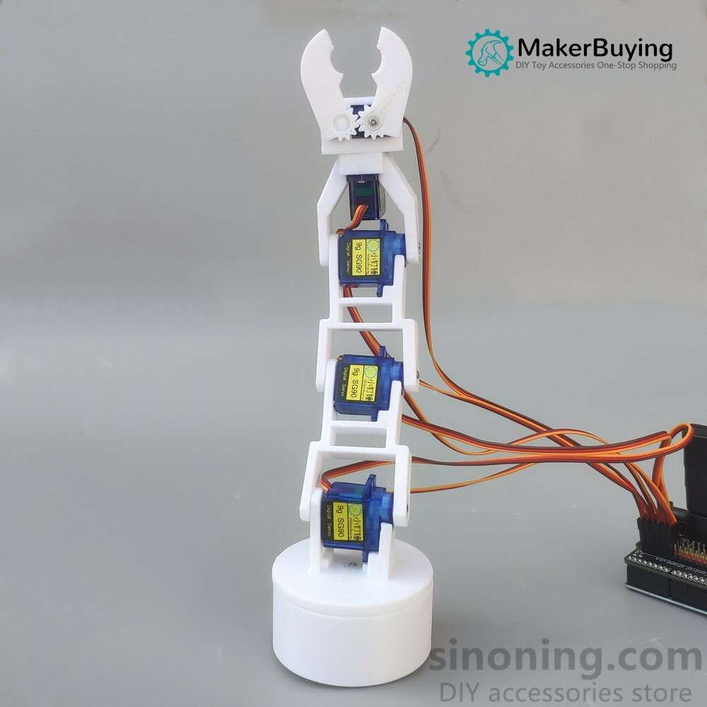
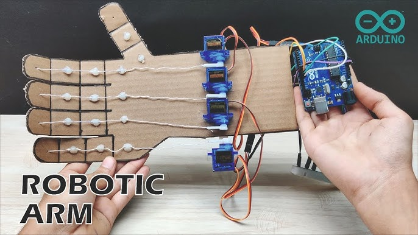
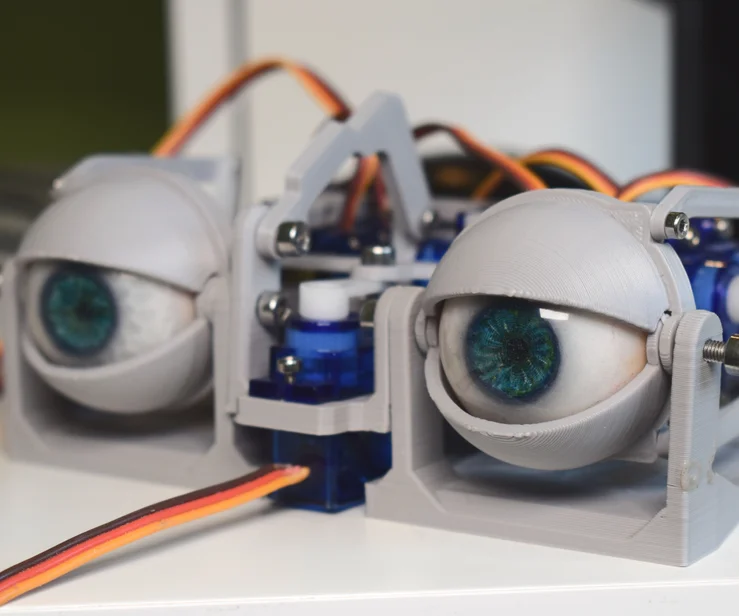
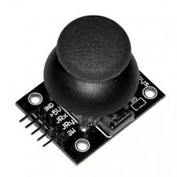
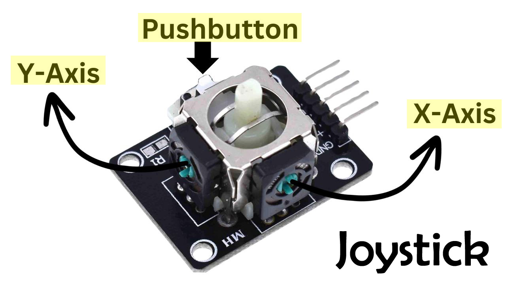

## Technical Basics II
####  Week 5
<br>
<br>
Lecturer: Qianxun Chen

<!-- get tape from office -->
---

...
Light
Sound
<b>Movment</b>
...

---

DC Motors & <b>Servo Motors</b> & Stepper Motors
<!-- easist to control -->

---
### Servo Motor
SG90 




<!-- 
if you take a look inside your servo, you can see that a servo is actually a dc motor plus a potentiometer and some plastic gears

there are multiple extra plastic pieces that you can attach to your servo, we are going to attach the smallest one, just to see things moving. In a real world situation you usually want to secure the hand onto the servo using the screw, and secure your servo to a fixed position with the two other screws attached. 


it's the cheapest servo motor on the market, so the material is rather fragile and it doesn't have a long term of life, but sometimes if you find a servo broken, you could unscrew the screws in the back and maybe just realise in the end that it's just one cable coming off the soldering point.

-->

---
<!-- 
SG90 is a positional servo
a servo can be less than 180 in reality

180 -> pwm signal
continous 360 -> digital signal, myservo(90) stop, 0/180 cw/anti-cw rotation

-->

|  | Positional Servo | Continuous Servo| 
| ------ | ------ | ------ |
| Angle |  <b> 0 - 180</b> | 0 - 360 |
| Signal(PWM) |  Position | Speed |
| | <b>SG90</b> | |


---
#### Exercise 1 Control a Servo Motor

```cpp
#include <Servo.h>

void setup() {
  // Attach pin 9 to the servo object
  myservo.attach(9);
}

void loop() {
  // Write to a position from 0 to 180
  myservo.write(0);
  delay(2000);
  myservo.write(180);
  delay(2000);
}
```

<div class="caption">
https://docs.arduino.cc/libraries/servo/
</div>


---

- How to make your servo move slower?
- Make your servo moves fast in one direction but coming back slowly to its starting position.

<!-- //  for (int pos = 0; pos <= 180; pos += 1) {
//     // Tell servo to go to 'pos'
//     myservo.write(pos); 
//     delay(2);           
//   } -->

---


#### Exercise 2 Control a Servo with a Potentiometer
- analogRead(), map()



---
#### Other Common Positional Servos
MG90S |   SG5010     | Micro Servo

<br><br><br><br><br><br><br><br><br>






<!-- mg90s for a bit more reliable/precise servo than sg90 (metal gears), similar size

sg5010 more durable, bigger, less noisy
micro servo for sth really tiny 

break? -->


---
#### Usages
<br><br>
<br><br><br><br><br><br><br>





<!-- 
control a big arrow 
drawing machine, robot arms
 -->

---
<!-- finer movement such as a hand -->




<br><br><br><br><br><br><br><br><br>
<div class="caption">

https://www.youtube.com/watch?v=-DiSJ9hOx7k
https://www.instructables.com/Simplified-3D-Printed-Animatronic-Dual-Eye-Mechani/

</div>

---
##### Tail
<!-- <iframe width="560" height="315" src="https://www.youtube.com/embed/jqrouAe4ZX0?si=hqBh-5Nvj13uc0ag" title="YouTube video player" frameborder="0" allow="accelerometer; autoplay; clipboard-write; encrypted-media; gyroscope; picture-in-picture; web-share" referrerpolicy="strict-origin-when-cross-origin" allowfullscreen></iframe> -->


<div class="caption">

https://www.instructables.com/Soft-Wire-driven-Oscillating-Tail-TfCD-Course-TU-D/
</div>

---
##### Micro Servo + ATTiny


<div class="caption">
Itch, Nilufer Musaeva, https://digitalmedia-bremen.de/project/itch/
</div>

---




<!-- two potentiometer being connected to the same central rod, on one side there is a push button -->
---

#### Exercise 3 Joystick
- Start Serial monitor
- Print analog reading value from A0,A1 and digital reading from pin2
- How do they react to the control?


---
#### Exercise 4 Joystick + Two Servos
- Stick the side of the second servo to the mount of the first servo (servo1 - x, servo2 - y)
- Use the Joystick to control the movement (Press button to come back to center)


<!-- - Pair up with a neightbour so that you can control two servos from one arduino -->

---
#### Wrap-up
- Servo motors
- Joystick

<!-- Tutorial 35
 https://www.youtube.com/watch?v=CEz1EeDlpbs&t=65s -->