## Technical Basics II
####  Week 6
<br>
<br>
Lecturer: Qianxun Chen

---

#### Movement
|

Stepper Motor

---
#### How does a stepper motor work?

https://www.youtube.com/watch?v=eyqwLiowZiU

<!--  how it works youtube -->

---
#### Stepper Motor + Driver
28BYJ-48 + ULN2003 
 <br>
 <br><br><br><br><br><br>
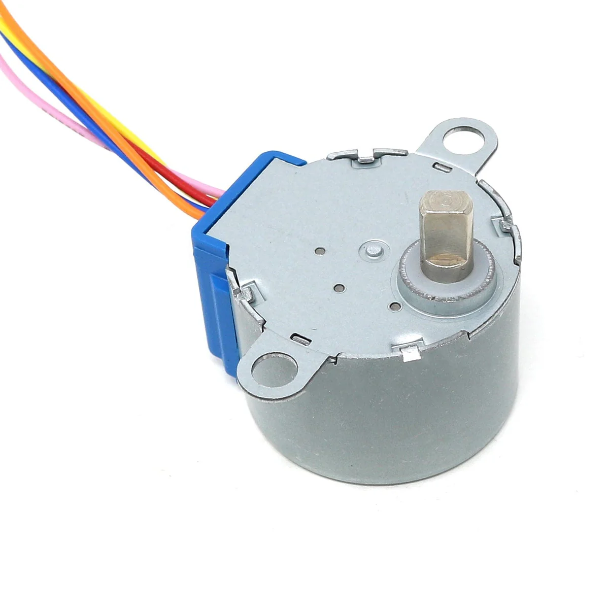

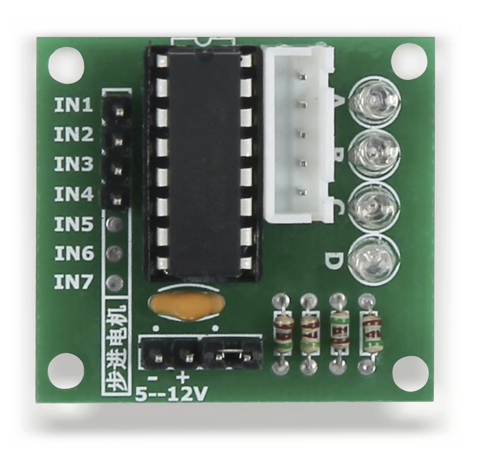

<!-- stepper motor is less straight forward as a stepper, it needs some complicated translation between movements & signal... so better usea driver -->
---

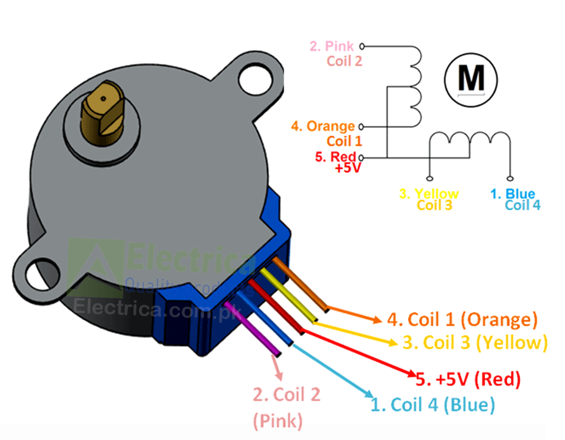

<!-- 1,3
 2,4 
 
 many other stepper motors are 1,2; 3,4-->

---

### Libraries
- There are many libraries out there for stepper motors...
- We are using [<b>cheapStepper</b>](https://github.com/tyhenry/CheapStepper) today, for the 28BYJ-48 stepper motor using ULN2003 driver board
* Arduino Default: [Stepper](https://docs.arduino.cc/libraries/stepper/) - a generic library for a variety of stepper motors 
* For finer control of speed, location and acceleration,  see [AccelStepper](https://www.airspayce.com/mikem/arduino/AccelStepper/)

<!-- I didn't use [the standard Stepper library](https://docs.arduino.cc/libraries/stepper/) that comes with Arduino IDE because it can be a bit confusing with 28BYJ-48 -->

----

#### Exercise 1 Steper Motor: Step

Power from power module

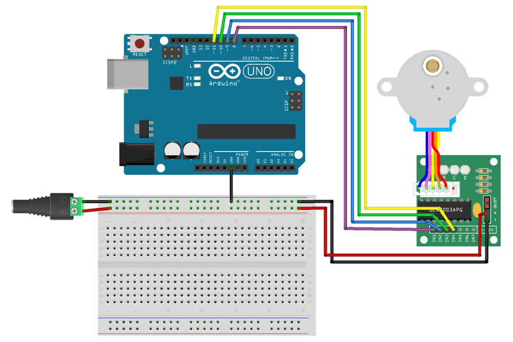

<!-- if this is working you shall see leds lighting up on your contorl board 

the power supply module in miuzei doesn't seem to be stable enough to control the stepper
-->

---

In case the LEDs on your control board don't light up...
You can also use 5V directly from Arduino
(In general one shall <b>not </b> power a stepper motor directly from an arduino, but it works to certain degree)

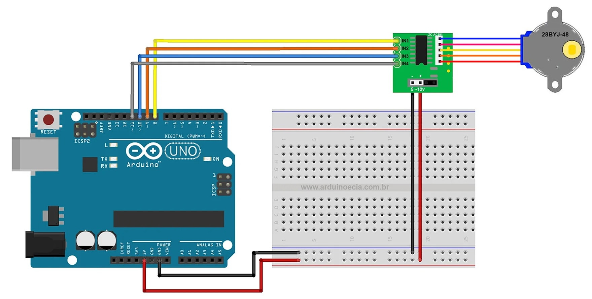

<!-- we are only doing this because the power we get from the power module doesn't seem to be reliable enough and we don't have other power sources. 
-->
---
#### Code
Download `1_stepper_step` from week6
- <b>Steps per revolution</b>: how many steps a stepper needs to finish one round
- This value can varry based on different stepper motors (and the settings on the motor driver) 
- How to switch back and forth with clockwise / counterclockwise?
<!--  moveClockwise = !moveClockwise in the end -->
---

#### Exercise 2: Stepper Motor - move

```cpp
stepper.move() // the movement
stepper.moveTo() // the destination
```
- <b>The Arduino sketch "pauses" during move()</b>
- Make your stepper motor rotate 2 rounds CW
- Make your stepper motor move 90 degree CCW
- Try to set it both with steps per revolution and degree

---

#### Exercise 3: Move and more

Download `3_stepper_run`

- Add a button to pin2 (remember to use internal pullup)
- Stop the motor when button is pressed

```
stepper.stop()
```

---

##### Step 2:
Add 2 LEDs to your current set up (with 220 ohm resistors). Make red led light up when motor moving anti-clockwise, green led light up when motor moving clockwise. No LED lights up when button is pressed.

---

##### Challenge
- Notice that now every time when the button is pressed, the previous movement is forgotten
- How to modify the sketch so that every time you press the button, the previous movement can be remembered, and can be continued after button is released?

<!-- break -->

----
#### Nema Motors
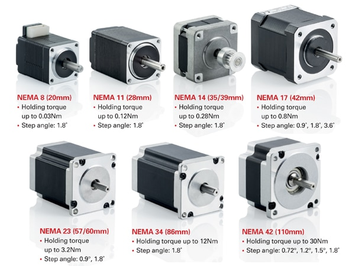


---
#### Stepper Motor Drivers
(nema motors)
- Cheapest: A4988
- Better: DRV8825
- Best: TMC2208/09

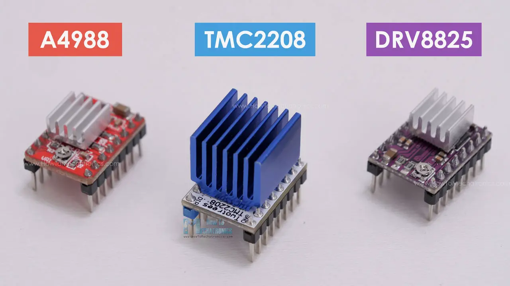

<!-- 
drc8825, more power, more precision
tmc is just silent and smooth like a dream
TMC based in hamburg 

relatively easy to burn if you do sth wrong, so better start prototyping with the cheaper ones -->

---
#### Examples
<br><br><br><br><br><br><br><br><br>

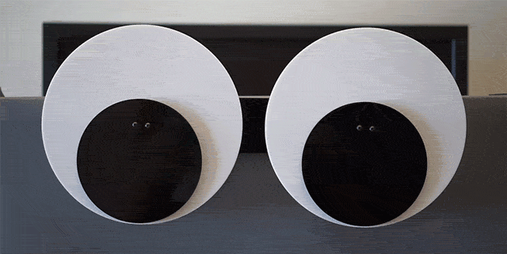


---
Threaded Rod  vs Pulley + Belt
<br><br><br><br><br><br><br><br><br>

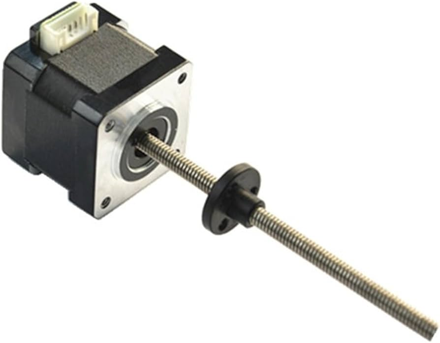

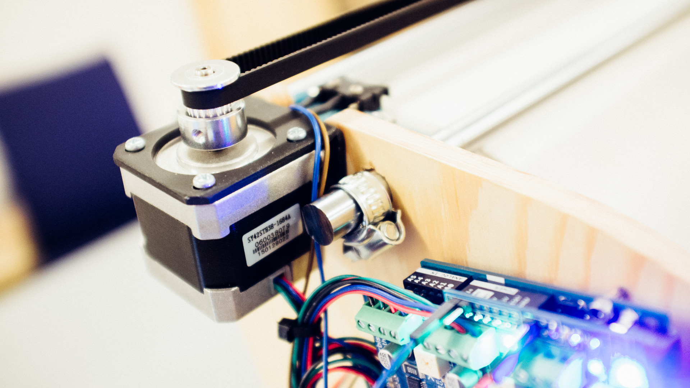
<!-- 
3d printer, cnc machine, laser printer -> things that need precisions and need some torque
metal rod -> linear movement
belt 
 -->

---

### Soldering Basics: Tools
* Soldering Iron
* Solder
* Helping hand
* (Soldering Paste)
* (Desoldering pump/wig)
---

##### Soldering Tutorial for Beginners: Five Easy Steps
https://www.youtube.com/watch?v=Qps9woUGkvI

<!-- 350 celsius -->
---

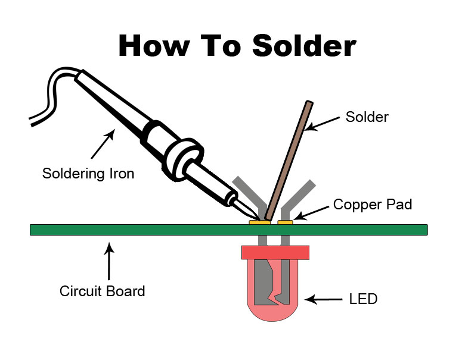

---

#### Each group take
- A soldering station
- A helping hand
- Some solder

---
#### Exercise 4 Solder the DC Motor
Steps
1. Take two wires, one in red, one in black
1. Cut off the pins from one side
1. Expose 3mm of cooper and twist the cooper together
1. Put solder onto the wires and the soldering points
1. Solder things together
1. Check connections
---

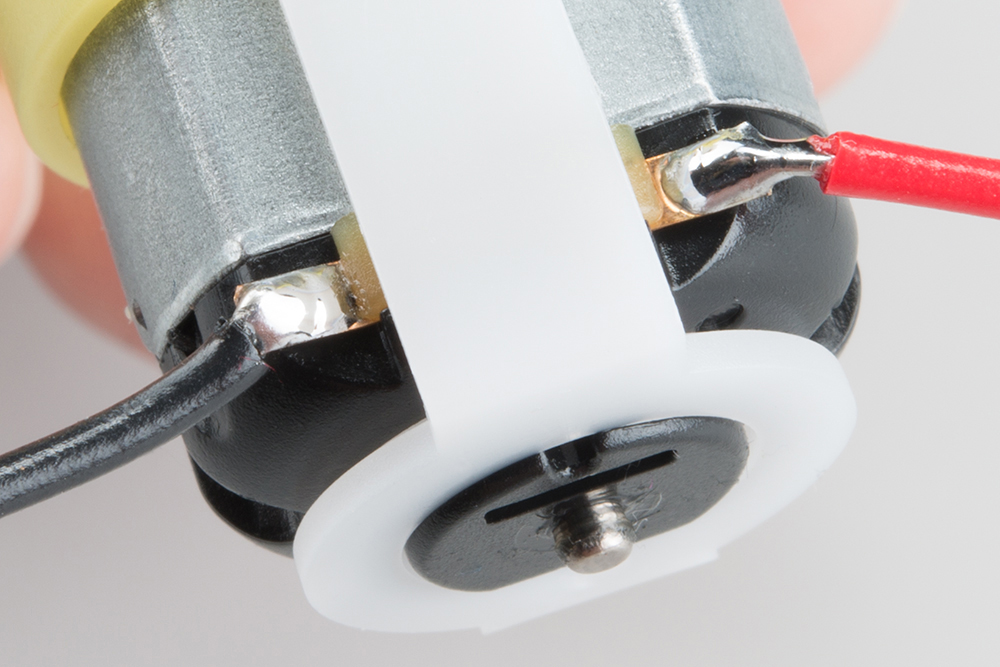
<!-- try to expose as little wire as possible -->

[Intro to Soldering](https://www.instructables.com/Intro-to-Soldering/)

