## Technical Basics II
####  Week 7
<br>
<br>
Lecturer: Qianxun Chen

---

### Soldering Basics: Tools
* Soldering Iron
* Solder
* Helping hand
* (Soldering Paste)
* (Desoldering pump/wig)
---

##### Soldering Tutorial for Beginners: Five Easy Steps
https://www.youtube.com/watch?v=Qps9woUGkvI

<!-- 350 celsius -->
---


---

#### Each group takes
- A soldering station
- A helping hand
- Some solder

---
#### Exercise 1 Solder the DC Motor
Steps
1. Take two wires, one in red, one in black
1. Cut off the pins from one side
1. Expose 3mm of cooper and twist the cooper together
1. Put solder onto the wires and the soldering points
1. Solder things together
1. Check connections

---


<!-- try to expose as little wire as possible -->

[Intro to Soldering](https://www.instructables.com/Intro-to-Soldering/)

---

### DC Motors
- Usages: toy cars, robotics, fans...
- If you missed the class this week, you can solder your dc motor in the digital media lab

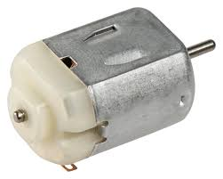

---
### Motor Comparison

|  | Servos | Stepper Motors| DC Motors|
| ------ | ------ | ------ | ------ |
| Control System | no feedback| high precision | precise control
| Speed and Torque |  High torque at low speeds | good at dynamic tasks with speed changes | High speed
|Applications | Low-speed, high-precision tasks |Dynamic, high-performance tasks | High-speed applications

---
<div class="columns">

<div>

### Diode
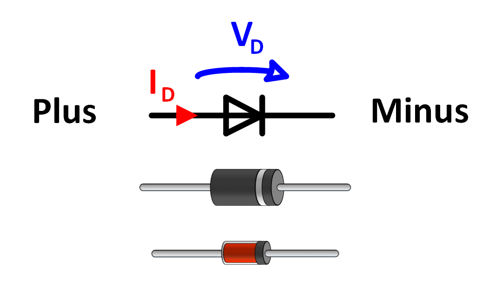

* We put a diode between the + and the - of a DC motor to protect the control electronics from voltage spikes  

<!-- When the motor's power is suddenly switched off, the collapsing magnetic field in the motor's coils generates a high voltage that would normally be absorbed by the control components like transistors, potentially damaging them. -->
</div>

<div>

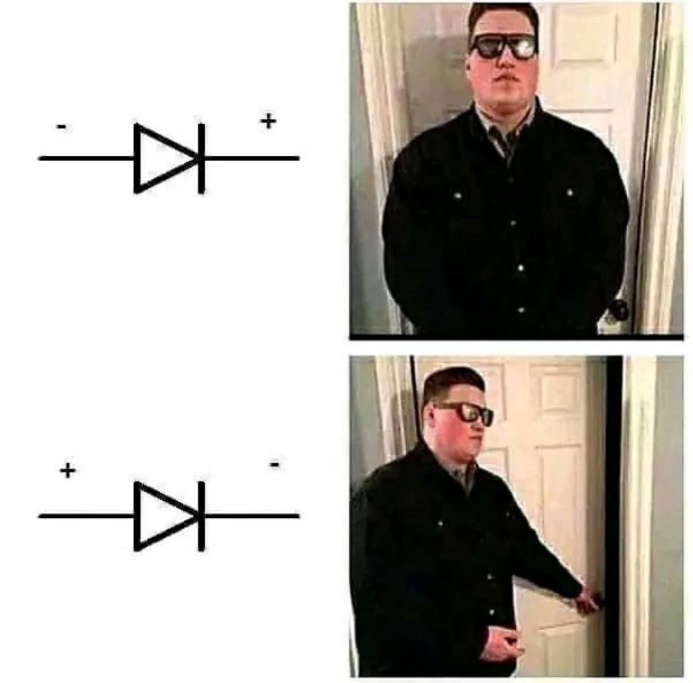
<p class="caption">From Cil's gist contribution</p>

</div>
</div>

---
### Transistor
- A semiconductor device used to switch or amplify electrical signals and power
- NPN/PNP: direction of current flow is different

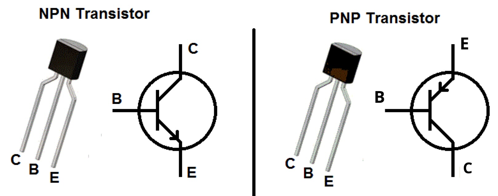

<!-- npn is more common, emitterisconnected to ground-->
---
#### Transistor
- <b>Collector (C)</b> collects the majority of the charge carriers that are emitted from the emitter.
- <b>Base (B)</b>This is the control terminal. A small current or voltage at the base can control a larger current flow between the collector and emitter.
- <b>Emitter (E)</b> emits the charge carriers (electrons in an NPN transistor) into the base

---
#### Exercise 2 DC Motor Transistor + Diode
- NPN transistor: 2N2222

<br><br><br><br><br><br><br><br><br>

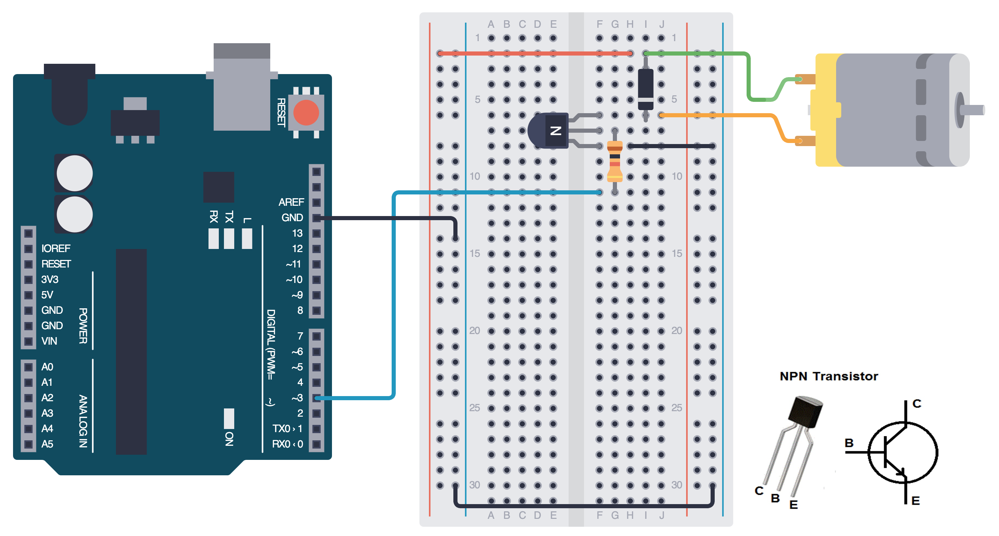
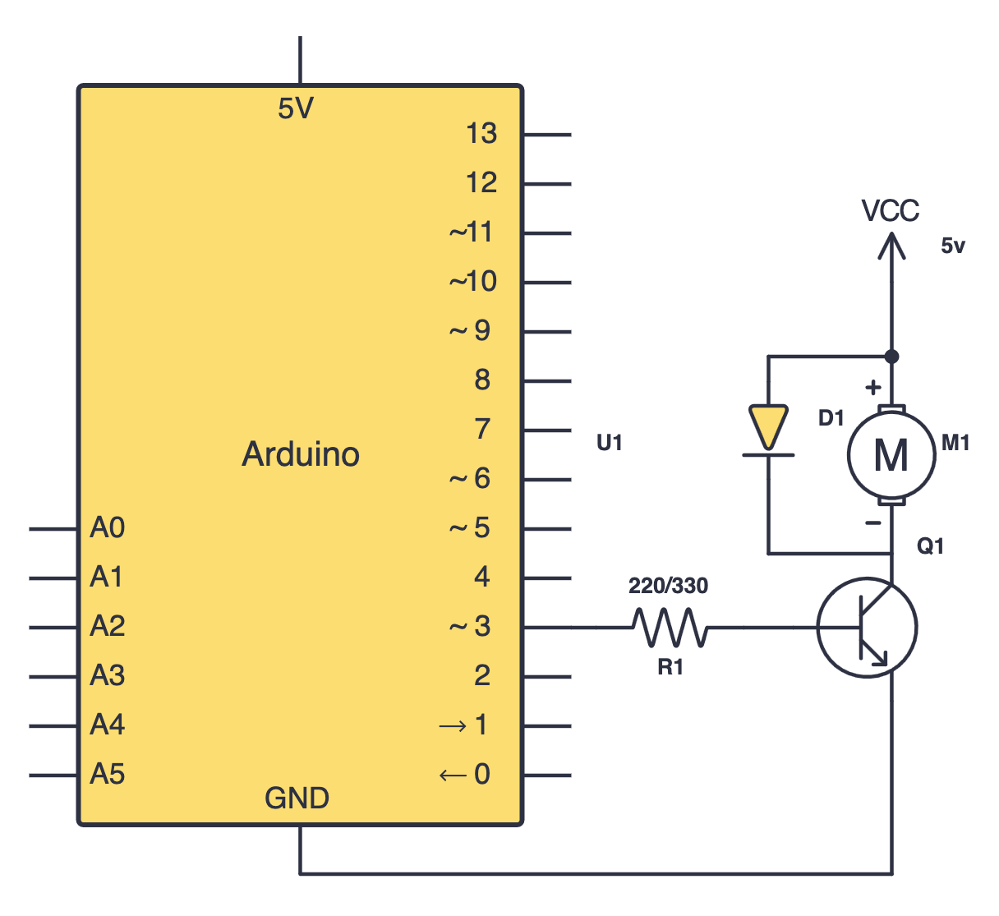

- Fallback: use 5v on arduino instead

---
- Try to control the DC motor with `digitalWrite()` 
* Then try to control it with `analogWrite()`
* The DC Motor needs around 100/255 duty cycle for minimum requirement to rotate
* If it has a hard time to start rotating in low speed, a short kick at full duty cycle would help
```cpp
analogWrite(pin, 255);
delay(100);
analogWrite(pin, 128);
```

---
<!-- analogWrite 100 -->
<!-- digital high/low -->
<!-- break -->
#### Break

---

#### Exercise 3 Button as a Toggle Switch
1. Add a potentiometer to control the DC motor speed.
Use `map()` to convert the potentiometer’s analog value to the speed range required by the motor

2. Add a button that toggles the motor state:
– If the motor is running, pressing the button stops it
– If the motor is stopped, pressing the button starts it
Hint: seperate button and on/off state
<!-- previous  -->
---

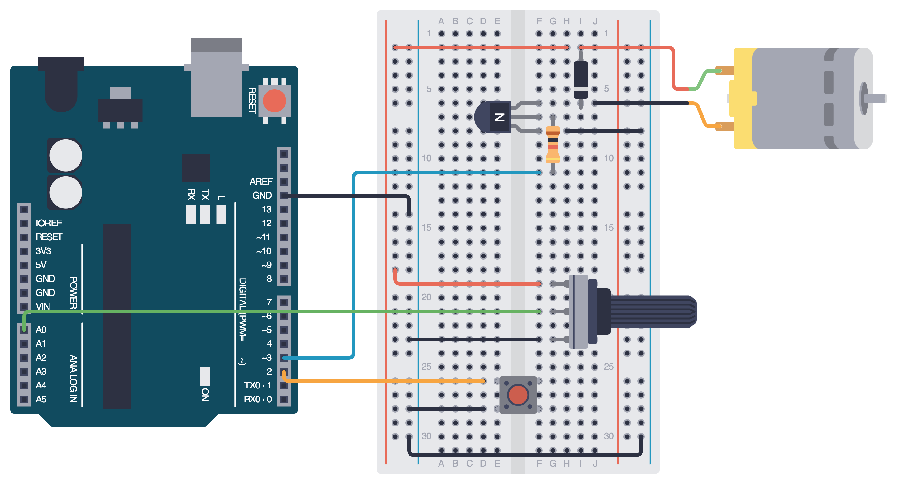

---

### Gear Motors
slower but more powerful

<br><br><br><br><br><br><br><br><br>

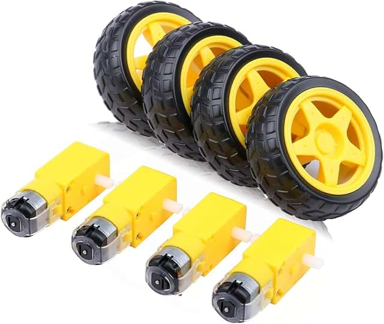

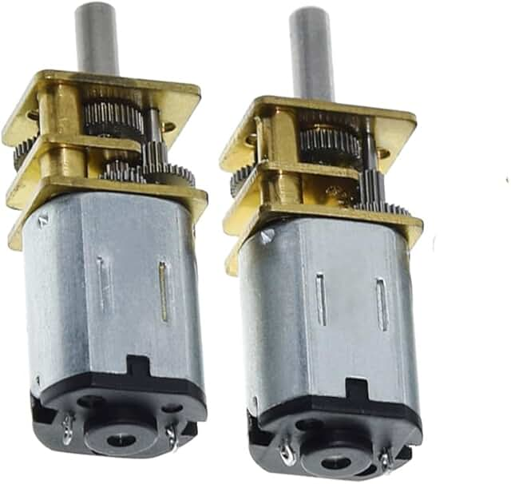

---

#### DC Motor Controllers
- Dual H-Bridge motor controller
- L293D (Elegoo Starter Kit)
https://www.youtube.com/watch?v=fPLEncYrl4Q
- Other popular controllers: L298N, TB6612fng
<!-- usually we control a dc motor with a controller -->

---
### Mosfet

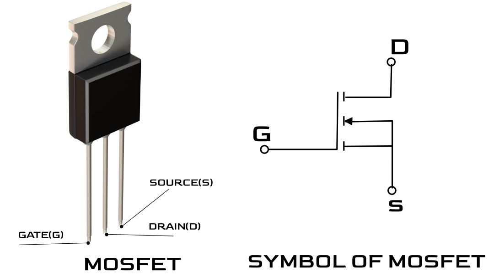

<!-- 
In general you can replace the resistor in our control circuit with a mosfet, the legs will be a bit different

Gate, Source, and Drain: A MOSFET has at least three terminals: the gate (G), source (S), and drain (D).
Voltage Control: A voltage is applied between the gate and source terminals. This voltage controls the conductivity, or "resistance," between the drain and source terminals. 

how much voltage you give to the gate is the most important factor
-->
---
#### How mofet/transistor works?
https://www.youtube.com/shorts/FdYaVhaLNVE

---

#### Relay
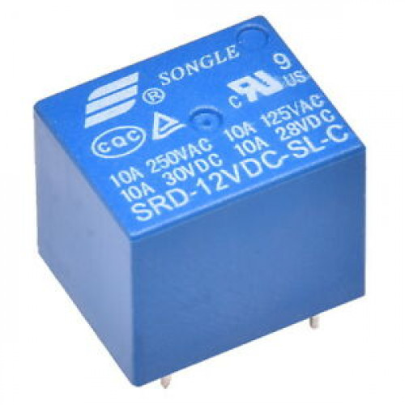
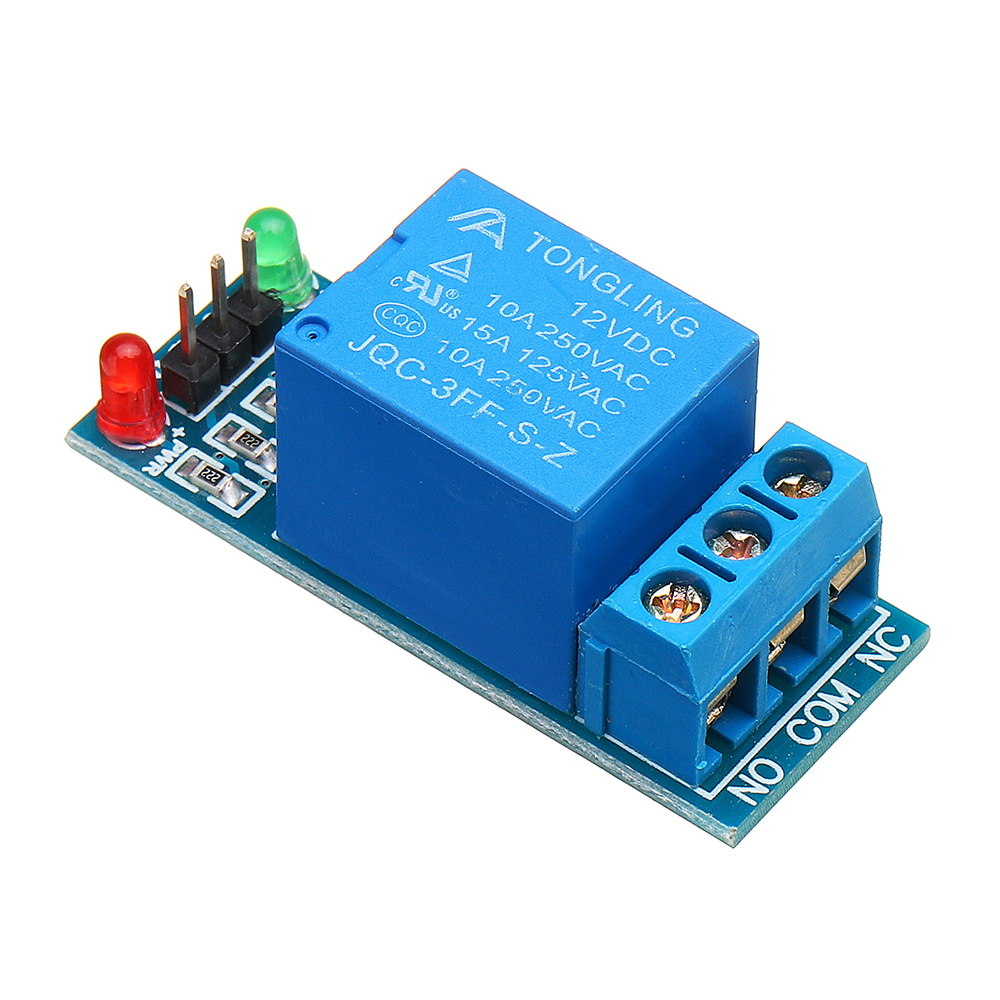

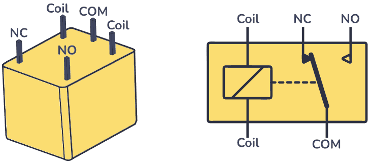

<!-- relay module 
using arduino to control the coil-->

---

##### Demo

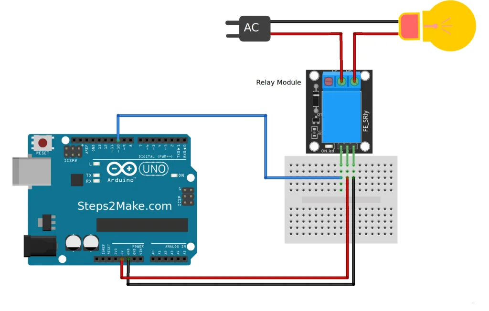

---

### Switches

|  | Transistors | Mosfets| Relay|
| ------ | ------ | ------ | ------ |
| Mechanism | current controlled | voltage controlled | electromechanical
| Connections | no guarantee of a complete shutoff || Completely disconnected
| Speed |  fast | fast | Slow
|Common Applications | Low-power DC | High-power DC | AC

---
### Final Project

Sign up for initial presentation slots: [sheet](https://leuphanalg-my.sharepoint.com/:x:/r/personal/qianxun_chen_leuphana_de/Documents/2025_26%20WiSe/Technical%20Basics%20II_2025_26.xlsx?d=w5ecffadd71d543a785a077e473ea42bd&csf=1&web=1&e=LzYRWF)