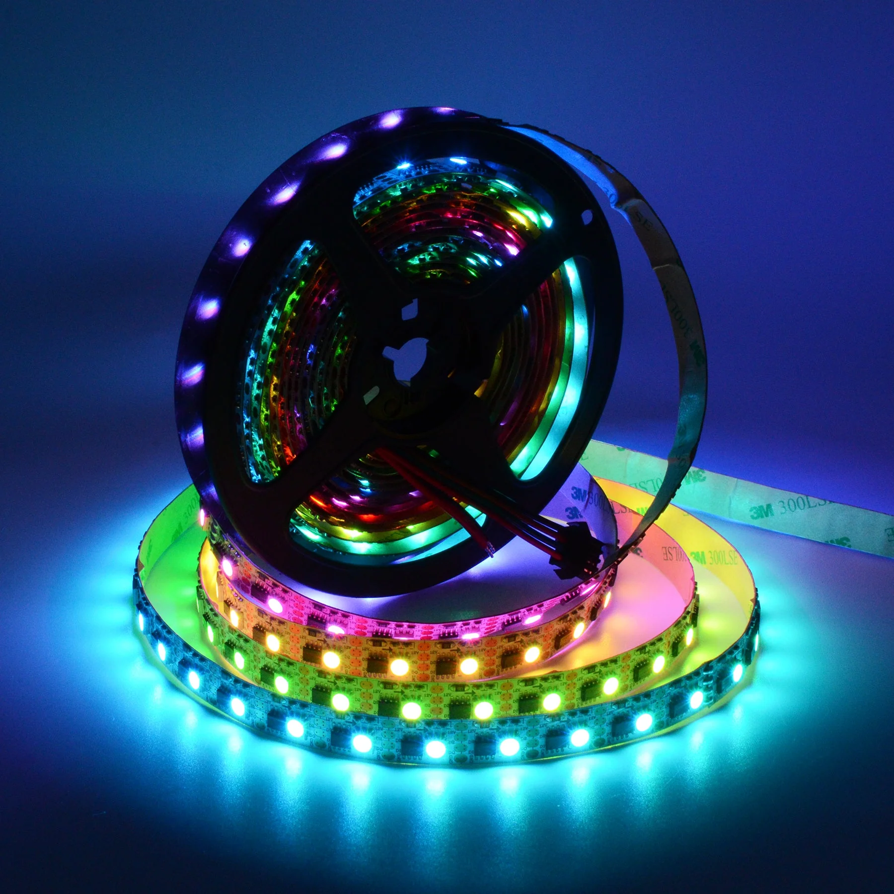
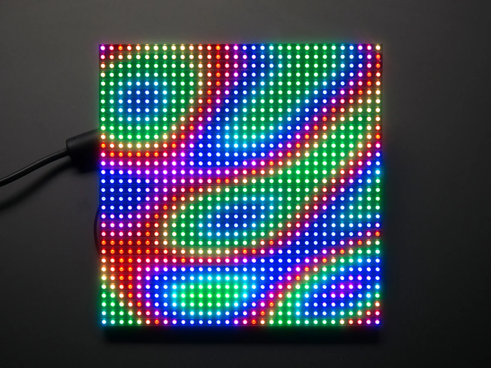
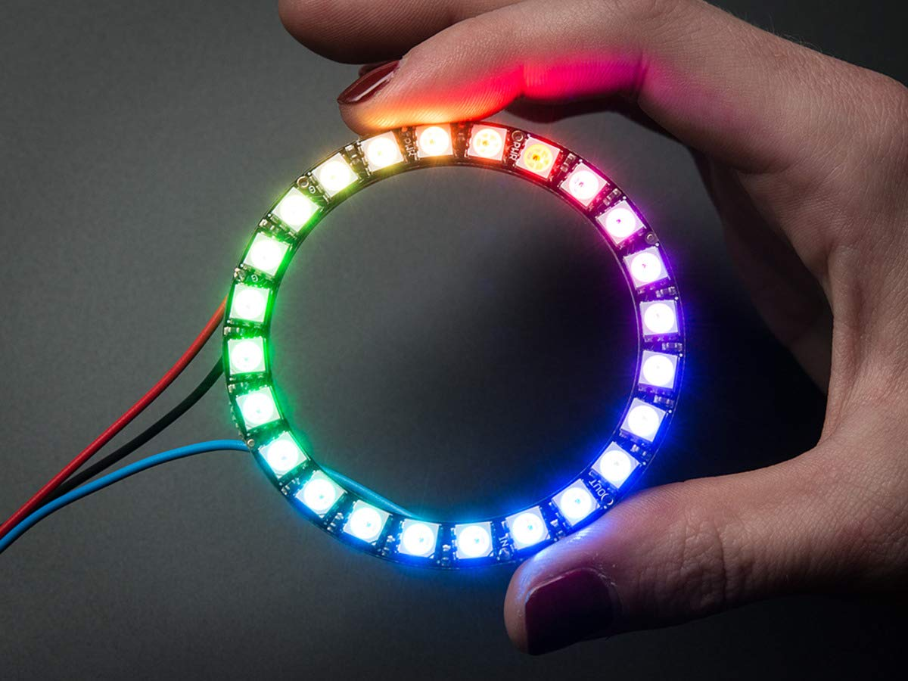
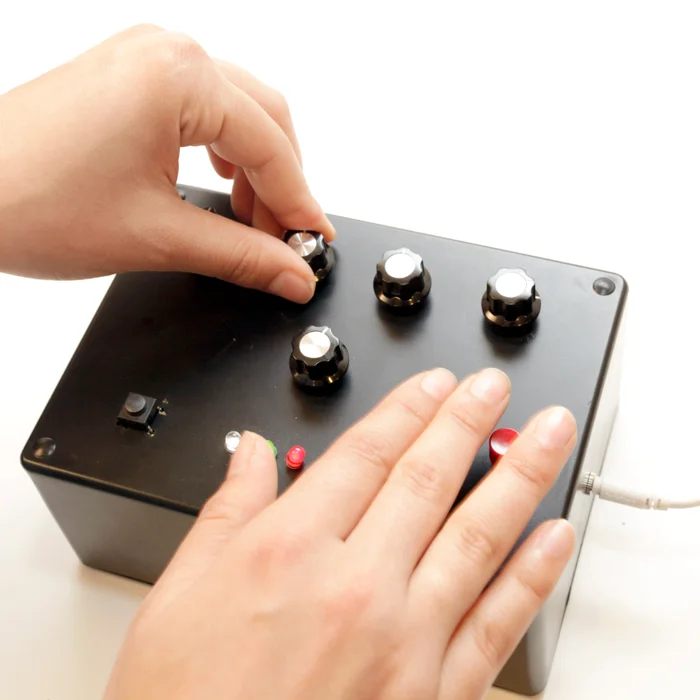
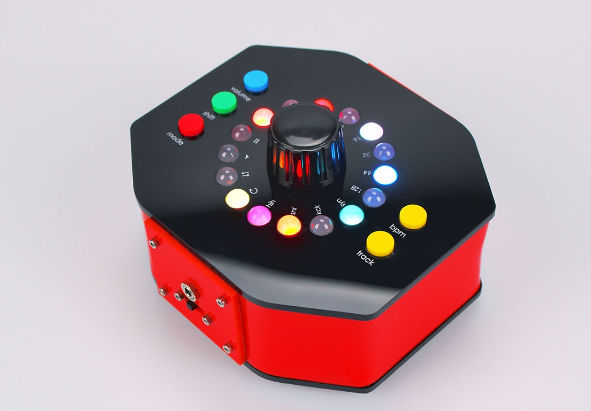
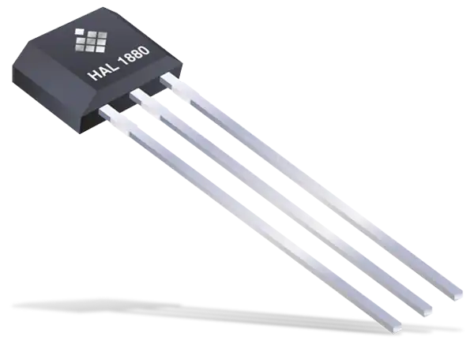
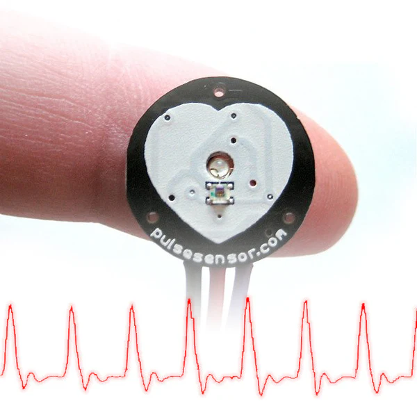
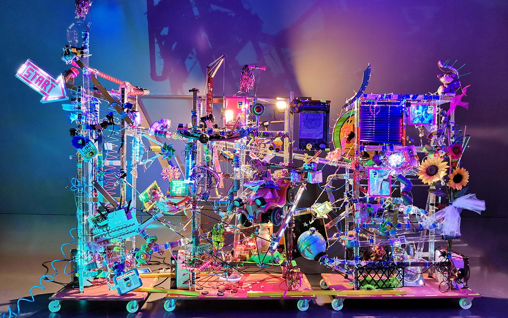
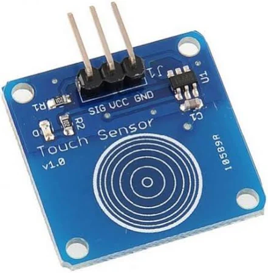

## Technical Basics II
####  Week 8
<br>
<br>
Lecturer: Qianxun Chen

---

### Project Inspirations

---
### Topics
- LEDs
- Sound
- Sensors + Motors
- Interface
- Code + Display

---
<div class="columns">
<div>

#### LEDs
- LED Stripes
- Adafruit NeoPixel
- LED Matrix
- [LED Cube](https://www.instructables.com/Led-Cube-8x8x8/)
<br>
- For interior deco, wearables, ambient light, party display...

</div>

<div>

| |  |
| :---: | :---: |
| |  |

</div>

</div>


<!-- good for interior deco, ambient light, party display -->

---
#### Sound
- Music instrument
- [Simple synthesizer](https://www.instructables.com/The-Arduino-Synthesizer/)
- [Sequencer: Gammaphon](https://felixfisgus.de/work/001_gammaphon)
- Sensor -> Sonification




---
##### Maywa Denki & Otamatone


https://www.youtube.com/watch?v=4e3UnyGf76I

---
<div class="columns">
<div>

#### Other Cool Sensors
- Hall effect sensor - magnets
- Stretch sensor
- Accelerometer and gyroscope sensor (MPU6050): motion feedbacks
- Heart rate sensor
...

</div>

<div>

| |  |
| :---: | :---: |
| |  |

</div>

</div>

---
#### Game and Interface
- Game console 
- Mini game with buttons/Joystick/Buzzers and a small display
- [ArduinoGotchi](https://github.com/anabolyc/Tamagotchi): A real Tamagotchi emulator for Arduino UNO

---
##### Smart Fairy Tale
by Felix Fisgus and Niklas Roy 


https://felixfisgus.de/work/016_smartfairytale

---


---
#### Strategies for your final project
- Mutiply one simple setup 
- Simple mechanism with a polished presentation (deco, casing, wearables)
- Creative use of technology
- Technical Complexity
<!-- Ex: instead of one servo -> 9 servos, things will get naturally more complicated if you want to drive multiple things -->

---
#### Process
1. Brainstorm on the project ideas
1. Research on potential topics, is there any reference project online (youtube, instructables...)
1. Write down a list of components (shopping list) 
1. Power management: how am I going to power my project?
(PC, power bank, batteries, power supplies...)
-> <b>Project idea presentation</b>

---

5. Test all the components individually / Follow instructions
1. Put everything together: plan pin usage
-> <b>Final project presentation with a basic prototype</b>
1. Iterations
1. Finalisation: 
    - Optional: perfboard & casing
1. Documentation
-> <b>Final project submission</b>

---
#### Evaluation Criteria (10/12)
- Technical skills: programming and physical computing
- Documentation: photos, process, iterations
- Creativity: concept, aesthetics and presentation 
- Demo Video
---

<!-- Break -->

---
#### Communication between Arduino & Python
Serial Communication
- Two senarios: 
    - Inputs from Arduino -> Interface in Python/Pygame
    - Command/Data from Python -> Display/Sound/Actions on Arduino

---
##### Step 0 : Install python library
- To read and write serial data to Arduino or any other microcontroller, we need to install <b>PySerial</b>
- Consider creating a dedicated virtual environment inside your folder for techBasics2
```
python3 -m venv env
source env/bin/activate
pip install PySerial
```

---
##### Step 1 : Check Arduino Port
`python check_ports.py`
<br>
- For Windows, it might be something like 'COM4'
- For MacOS or Linux, it might be something like '/dev/ttyUSB0' or '/dev/cu.usbmodem2101'

---
##### Step 2: Check Connection
- Upload `serial_demo.ino` to your Arduino
- Run `python arduino_serial.py`, pick mode 1 (Continuous Reading)
* <b>Notice</b>: you can only open one serial connection to an Arduino at a time. If the serial monitor in Arduino IDE is open, you need to close it before establishing a serial communication between Python and your Arduino.

---
#### Touch Sensor
digitalRead()


---
#### Exercise 1: Inputs from Arduino
- Connect the touch sensor to your Arduino
- Read from it and print the result in Serial with a 115200 baud rate
- Read the result from Python, mode 1 (Continuous Reading)

---
#### Exercise 2: Commands from Python
- Run `python arduino_serial.py`, pick mode 2
- Write an Arduino script that blink the LED on pin13 twice if a "BLINK" command is issued from Python
```cpp
  if (Serial.available() > 0) {
    String command = Serial.readStringUntil('\n');
    command.trim();
    // interpret the command here
  }
```