## Technical Basics II
####  Week 9
 
 
Lecturer: Qianxun Chen

---

#### Project Idea Presentations

---

#### CD40106
- Schmitt Trigger Inverter
- 6 Not Logic Gates
- Usage: generate Square-wave, creating oscillators
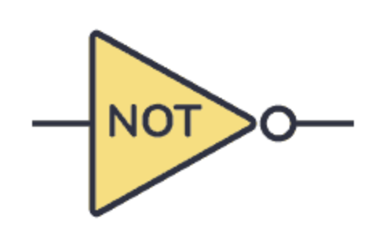

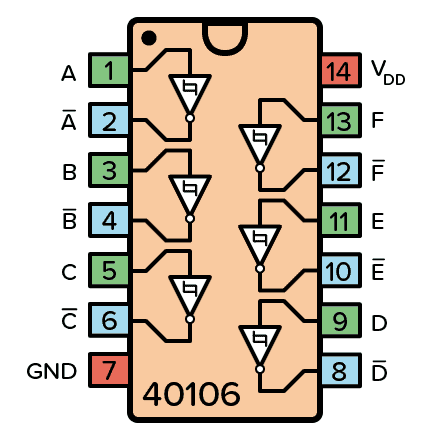

<!-- "CD" is the family and/or manufacturer prefix -->
---
### Intergrated Circuit (IC)
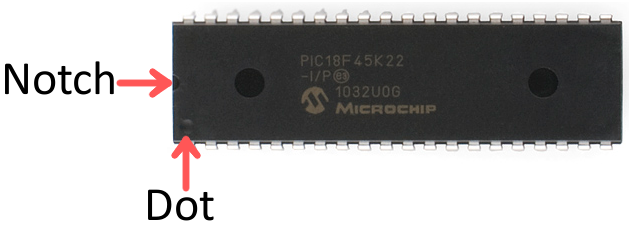
- A tiny electronic device combining many components onto a single chip to perform complex functions
- Direction: Notch -> Face Up, on the leftside of it is pin 1
- Pin numbers increase sequentially as you move counter-clockwise away from pin 1.

---
#### Capacitor
- A temporary energy storage tank that can be charged and discharged quickly 
- Unit: F(farad) pF->nF->uF
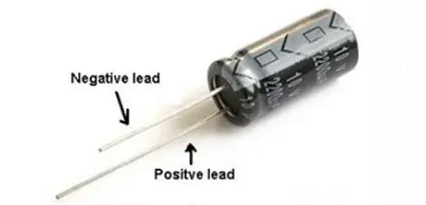

<!-- symbol, polarized, non-polarized,unit, voltage -->
---
##### Most Common Capacitor Types

Aluminum Electrolytic Capacitors & Ceramic Capacitors 
     
   
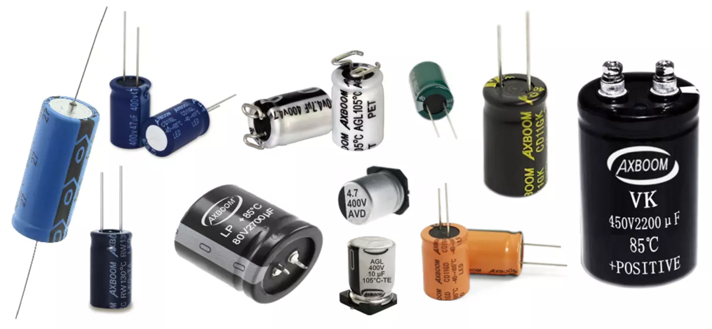
Polarized...................................Non-polirized 
- Voltage Rating: the maximum voltage a capacitor can safely handle (Usually twice the working voltage)
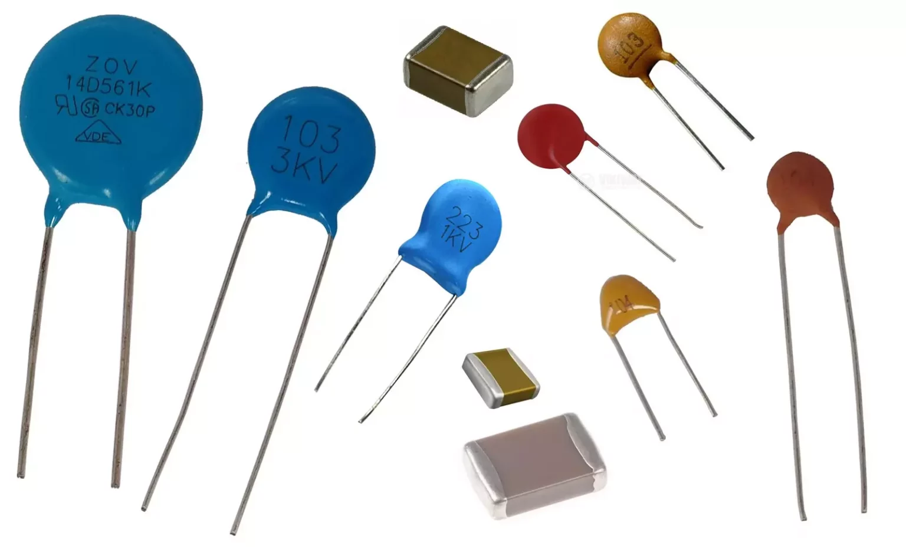

<!-- there are many types.... -->
---
#### Exercise 1: Blinking LED with CD40106
- List of components:
  - 1 Red LED
  - 2 10k resistors
  - 1 Capacitor (100uF or 47uF)
  - 1 IC: CD40106
<!-- capacitor and IC they receive from me, 47uF is faster

a resistor and capacitor to form an oscillator. The capacitor charges and discharges in a loop, creating a square wave signal that toggles the LED on and off. This setup is simple but highlights how the CD40106 can be applied to create timing circuits. Once built, it’s easy to adjust the blinking speed by changing the values of the resistor or capacitor.
 -->
---
#### Exercise 1
Power from Arduino 5V   is also okay 
       

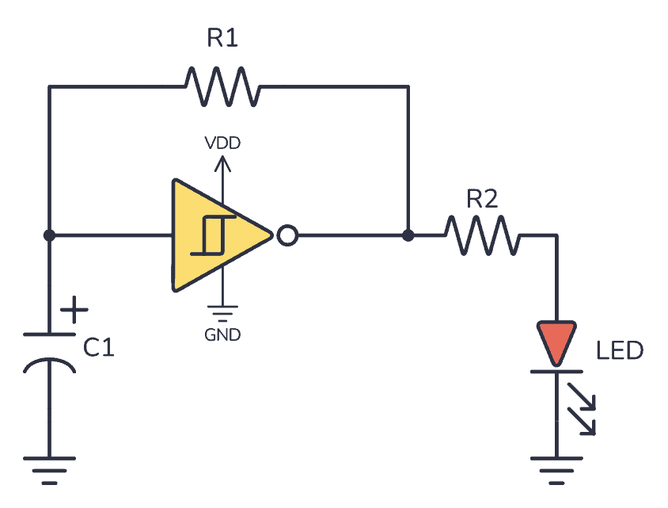
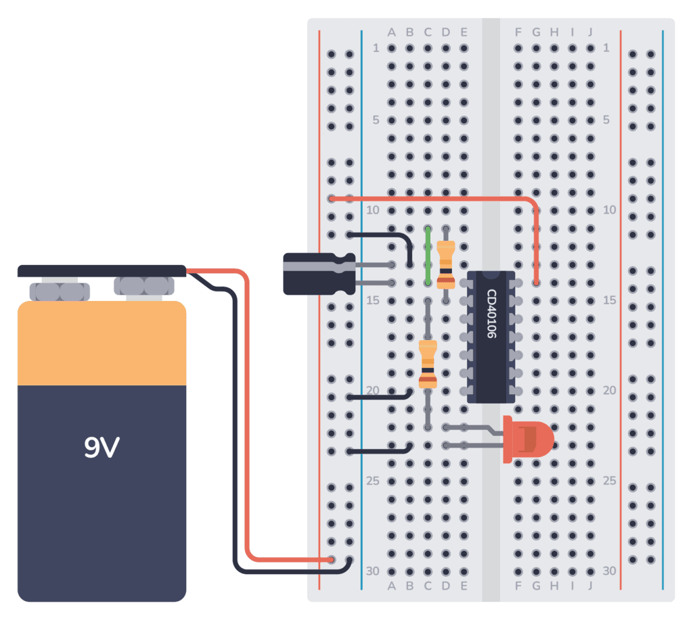

<!-- break -->

---
#### Exercise 3: Perfboarding

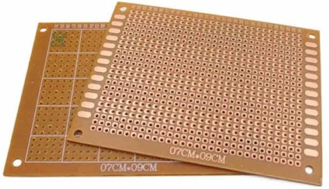
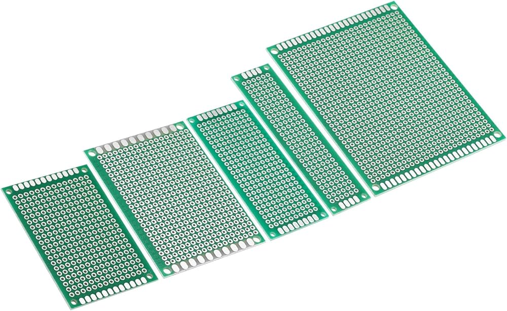
   
Perfboards
- One sided / double sided(Front and back are connected)
- (Don't heat the pads for too long, the cooper might come off)
---
##### Components
- IC Socket: easier replacement and to prevent heat damage to the chip during soldering
- Screw Terminal: More stable connection

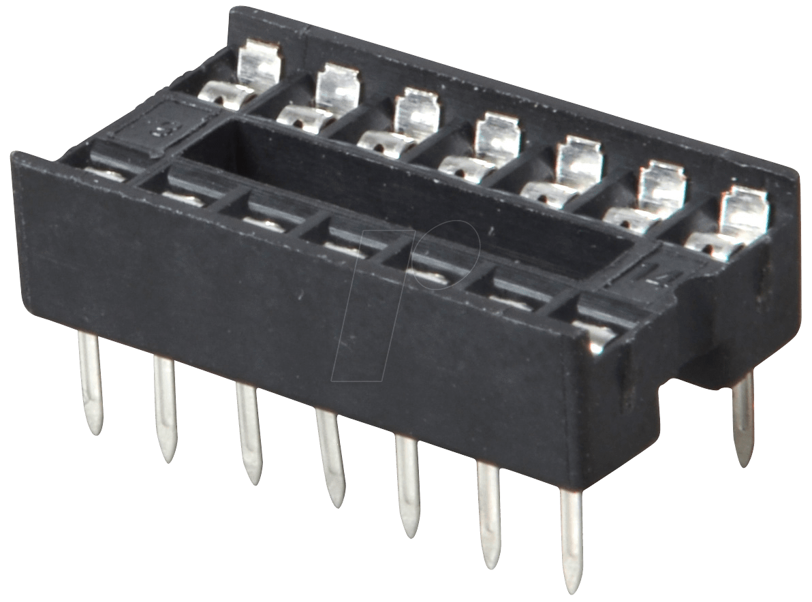
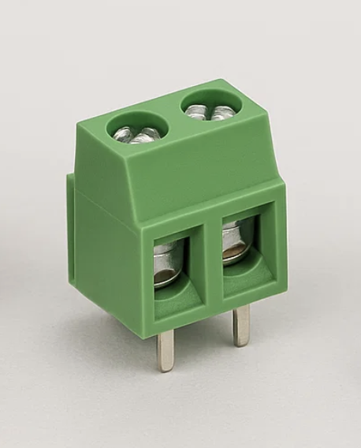

---
#### Perfboarding: General Principles
- Transfer from breadboard to perfboard:   IC -> flat components(resistors) -> higher components(capacitors, LEDs, screw terminals)...
* Place the coomponent -> solder component to the pads -> make connections
* Three ways to make a connection: 
  - use components leg (metal wire)
  - neighboring pads can be joined by solder
  - extra wires 
<!-- need some good planning with component legs -->
---
##### Step 1: Solder the IC Socket
            

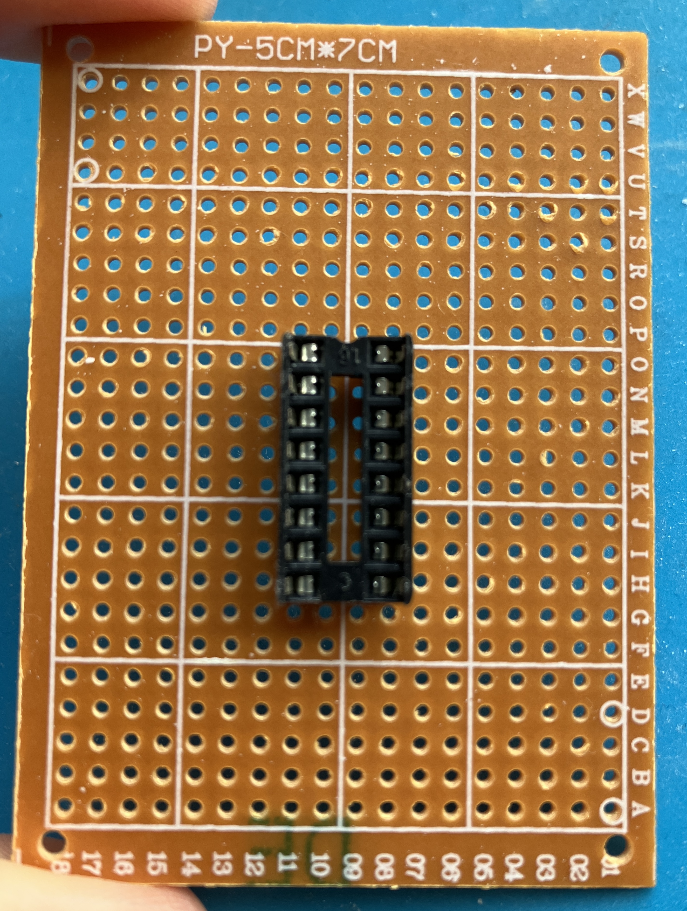
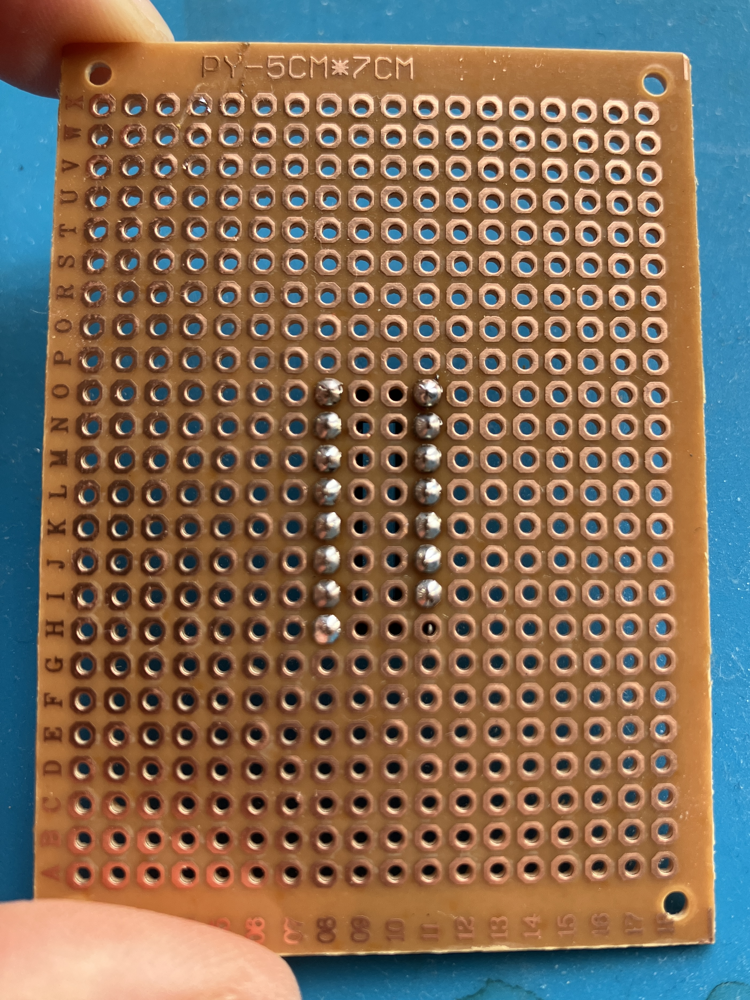
<!-- place it first, the terminal is larger than the IC,so the lower two points are not used -->

---
##### Step 2: Solder Resistors

            

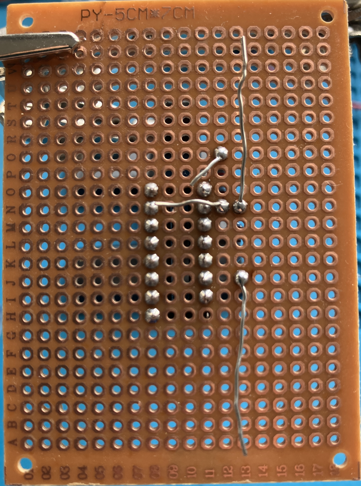

---
##### Step 3: Add LED and Capacitor
            

---
##### Step 4: Add connections for power
            
<!-- sample result -->
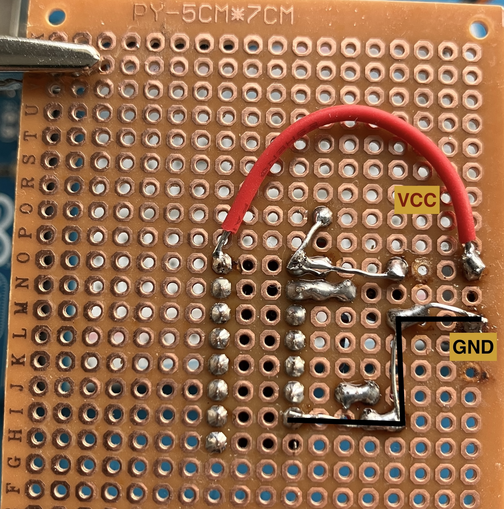

---

#### Challenge: Blinking 2 LEDs
- How to blink a red LED and a green LED alternately using a CD40106?
* Hint: Feed the output signal of the red LED to the input signal of the green LED

---
##### Solution
    
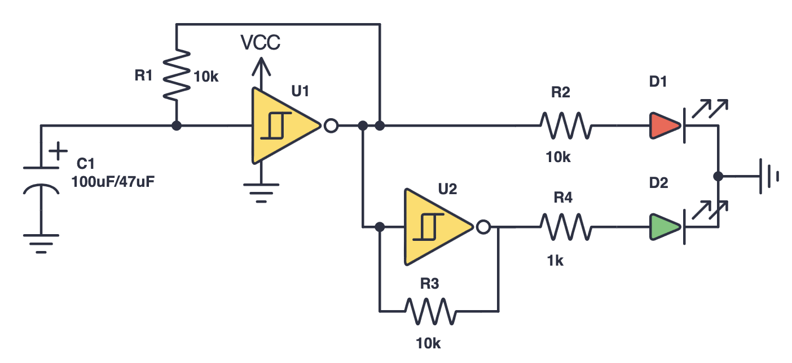
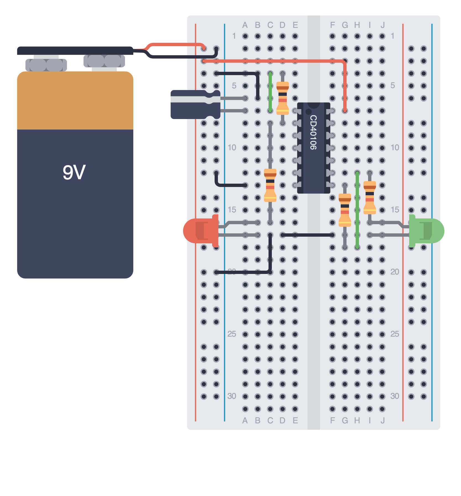
Use a 1 kΩ resistor for the green LED to match the brightness level of the red LED.

---

#### Solder Two Wires Together
If you need to solder two wires together, check this out:
https://www.youtube.com/watch?v=4xUBRMgcVhc